# Brain-Memory 数据流通道全面梳理

> 生成日期：2026-06-01
>
> 梳理粒度：L1 模块内部流 → L2 服务级流 → L3 端到端管道 → L0 类型转换链 → L4 插件生命周期

---

# 第一部分：L1 — 模块内部数据流

## L1 综述

L1 聚焦每个模块目录内各源文件之间的数据传递关系。共覆盖 **16 个模块组**。

每个模块组的呈现格式：
- **Mermaid flowchart** — 文件级数据流方向
- **数据流表格** — 每一步的输入/输出类型、转换逻辑
- **关键设计决策** — 为什么这样设计

---

## L1-1 · extractor/ 提取模块

### 文件组成

| 文件 | 角色 |
|------|------|
| `heuristic.ts` | 无 LLM 规则提取引擎（Tier 1） |
| `extract.ts` | 三级提取编排器：Tier1(启发式) → Tier2(LLM) → Tier3(容错) |

### 数据流图

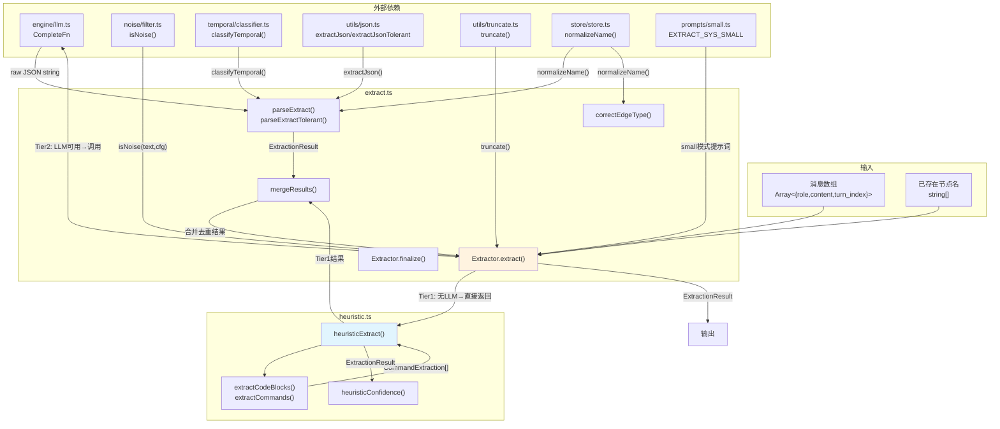

### 数据流步骤

| 步骤 | 函数 | 输入类型 | 输出类型 | 说明 |
|------|------|---------|---------|------|
| 1 | `Extractor.extract()` | `{messages, existingNames}` | `ExtractionResult` | 主入口 |
| 1a | `isNoise(text, cfg)` | `string` | `boolean` | 过滤寒暄/短消息 |
| 1b | `heuristicExtract(filtered)` | `{role,content}[]` | `ExtractionResult` | **Tier 1**: 代码块正则 + 命令正则 + 8 类规则匹配 |
| 1c | `heuristicConfidence(result)` | `ExtractionResult` | `'high'\|'medium'\|'low'` | 判断启发式结果可信度 |
| 2a | `llm(systemPrompt, userPrompt)` | `string, string` | `string (raw JSON)` | **Tier 2**: LLM 调用（支持重试 2 次） |
| 2b | `parseExtract(raw)` | `string` | `ExtractionResult` | 严格 JSON 解析 + `classifyTemporal()` 分类每个节点 |
| 2c | `parseExtractTolerant(raw)` | `string` | `ExtractionResult \| null` | **Tier 3**: 容错解析（引号修正 + 尾随逗号 + 补括号） |
| 3 | `correctEdgeType(edge, nameToType)` | `{from,to,type,instruction}` | `修正后的 edge \| null` | 根据 from/to 节点类型修正 11 种边类型 |
| 4 | `mergeResults(heuristic, llm)` | `ExtractionResult, ExtractionResult` | `ExtractionResult` | 合并去重: LLM 优先 → 补充启发式不重复节点 |
| 5 | `Extractor.finalize(params)` | `{sessionNodes, graphSummary}` | `FinalizeResult` | 会话结束时 EVENT 升级为 SKILL |

### 关键设计决策

1. **三级降级**：LLM 不可用时直接返回 Tier1 启发式结果；LLM 返回空则回退 Tier1；LLM JSON 解析失败走 Tier3 容错
2. **去重策略**：`mergeResults()` 以 LLM 结果为准（高精度），启发式补充 LLM 遗漏的节点（高召回）
3. **边类型自动修正**：`correctEdgeType()` 先检查 LLM 给定的边类型是否合法；不合法时根据 from/to 节点类型推断最匹配类型（如 TASK→SKILL 默认 USED_SKILL）
4. **small 模式**：使用 `~180 tokens` 的 `EXTRACT_SYS_SMALL` 替代 `~1200 tokens` 的完整提示词

---

## L1-2 · recaller/ 召回模块

### 文件组成

| 文件 | 角色 |
|------|------|
| `recall.ts` | 双路径召回引擎：精确路径 + 泛化路径 + 语义路径 + 外部路径 → 统一 PPR |
| `cache.ts` | LRU 查询缓存，内容级 hash 失效 |

### 数据流图

```mermaid
flowchart TB
    subgraph 外部依赖
        INTENT["retriever/intent-analyzer.ts<br>analyzeIntent()"]
        EXPAND["retriever/query-expander.ts<br>expandQuery()"]
        PPR["graph/pagerank.ts<br>personalizedPageRank()"]
        DECAY["decay/engine.ts<br>applyTimeDecay()"]
        TOKENS["utils/tokens.ts<br>estimateNodeTokens()"]
        SCOPE["scope/isolation.ts<br>scopeMatchV2()"]
        STORE_ADAPTER["store/adapter.ts<br>IStorageAdapter"]
    end

    subgraph 输入
        QUERY["query: string"]
        SCOPE_FILTER["scopeFilter?: ScopeFilterV2"]
        SRC_FILTER["sourceFilter?: 'user'\|'assistant'\|'both'"]
        EXTERNAL["externalNodes?: BmNode[]"]
    end

    subgraph recall.ts
        RECALL["recall()"]
        VCACHE["cache.isValid()<br>cache.get()/set()"]
        PS["getPreciseSeeds()"]
        GS["getGeneralizedSeeds()"]
        SS["_getSemanticSeeds()"]
        BATCH["batchSyncEmbed()"]
        TO_STORAGE["toStorageFilterV2()"]
    end

    subgraph cache.ts
        RC["RecallCache"]
        CH["_computeContentHash()"]
    end

    QUERY --> RECALL
    SCOPE_FILTER --> RECALL
    
    RECALL -->|"缓存检查"| VCACHE
    VCACHE --> RC
    RC -->|"isValid()"| CH
    CH -->|"md5(所有节点 id:updatedAt)"| STORE_ADAPTER
    
    QUERY -->|"意图分析"| INTENT
    INTENT -->|"IntentResult"| RECALL
    
    QUERY -->|"查询扩展"| EXPAND
    EXPAND -->|"expandedQuery"| PS

    RECALL -->|"路径1"| PS
    PS -->|"embed+vectorSearch"| STORE_ADAPTER
    PS -->|"searchNodes FTS5"| STORE_ADAPTER
    PS -->|"findCommunityPeers"| STORE_ADAPTER
    
    RECALL -->|"路径2"| GS
    GS -->|"communityVectorSearch"| STORE_ADAPTER
    GS -->|"findNodesByCommunities"| STORE_ADAPTER
    GS -->|"findCommunityRepresentatives"| STORE_ADAPTER

    RECALL -->|"路径3(LanceDB)"| SS
    SS -->|"searchIndex.semanticSearch()"| STORE_ADAPTER

    RECALL -->|"路径4"| EXTERNAL

    PS -->|"preciseSeeds: string[]"| RECALL
    GS -->|"generalizedSeeds: string[]"| RECALL
    SS -->|"semanticSeeds: string[]"| RECALL

    RECALL -->|"统一种子→graphWalk"| STORE_ADAPTER
    RECALL -->|"统一候选→PPR"| PPR
    PPR -->|"PPRResult{scores}"| RECALL
    
    RECALL -->|"时间衰减"| DECAY
    DECAY -->|"衰减后分数"| RECALL
    
    RECALL -->|"多路径加权×1.2"| RECALL
    RECALL -->|"时间敏感加权"| RECALL
    
    RECALL -->|"RecallResult"| VCACHE
    VCACHE -->|"缓存写入"| RC
    
    RECALL -->|"RecallResult"| 输出

    TO_STORAGE -->|"ScopeFilterV2→StorageFilter"| STORE_ADAPTER
    SCOPE -->|"scopeMatchV2()"| RECALL
    TOKENS -->|"estimateNodeTokens()"| RECALL

    style RECALL fill:#fff3e0
    style RC fill:#e1f5fe
```

### 数据流步骤

| 步骤 | 函数 | 输入类型 | 输出类型 | 说明 |
|------|------|---------|---------|------|
| 1 | `cache.isValid(storage)` | `IStorageAdapter` | `boolean` | 内容级 hash 对比，脏节点>0 或 hash 不匹配 → 缓存失效 |
| 2 | `analyzeIntent(query)` | `string` | `IntentResult` | 6 类意图分类 |
| 3 | `expandQuery(query)` | `string` | `string` | 15 组中英同义词扩展 |
| 4a | `getPreciseSeeds()` | `query, limit, scope, source` | `string[]` | 向量搜索(有 embed) / FTS5(无 embed) → 社区扩展(+2 peers) |
| 4b | `getGeneralizedSeeds()` | `query, limit, scope, source` | `string[]` | 社区向量匹配 → 社区成员 |
| 4c | `_getSemanticSeeds()` | `query, limit, scope` | `string[]` | LanceDB 语义搜索（ISearchIndex） |
| 5 | 四路径种子合并去重 | `4×string[]` | `string[] (unified)` | 位图标记路径来源(1/2/4/8) |
| 6 | `graphWalk(seeds, maxDepth)` | `string[], number` | `{nodes, edges}` | 从统一种子遍历图 |
| 7 | `personalizedPageRank()` | `seeds, candidates` | `{scores}` | 统一 PPR 排序 |
| 8 | 分数融合 | `PPR + pathCount + recency` | `ScoredNode[]` | 多路径×1.2 + 时间敏感加权 |
| 9 | `applyTimeDecay(score, node, cfg)` | `number, BmNode, Config` | `number` | Weibull 衰减乘数 |
| 10 | 最终排序→截断 topN | `ScoredNode[]` | `BmNode[]` | score → validatedCount → updatedAt |
| 11 | `cache.set(query, result)` | `string, RecallResult` | `void` | 仅无脏节点时缓存 |

### 关键设计决策

1. **四路径统一 PPR**：四条路径获得种子后，走同一次 graphWalk + 同一次 PPR，避免重复计算和分数不可比
2. **多路径增强**：同时被 2+ 条路径命中的节点得分 ×1.2，鼓励"多方印证"的记忆
3. **内容级缓存失效**：不再用简单的脏节点计数，改用所有活跃节点的 `id:updatedAt` 串联合并生成 md5 hash，避免节点更新后伪命中
4. **路径位图**：用 `1|2|4|8` 位图标记每个种子的来源路径，O(1) 判断多路径命中

---

## L1-3 · retriever/ 检索子系统

### 文件组成

| 文件 | 角色 |
|------|------|
| `intent-analyzer.ts` | 查询意图分类（6 类，规则驱动） |
| `query-expander.ts` | 中英双语同义词扩展（15 组预设） |
| `reranker.ts` | 外部 API 重排序 / 余弦相似度回退 |
| `hybrid-recall.ts` | 图+向量并行召回 → RRF 融合 |
| `vector-recall.ts` | 纯向量召回（向量搜索 + FTS5 → RRF 融合） |
| `admission-control.ts` | 写入准入控制（去重/长度/类别先验） |

### 数据流图

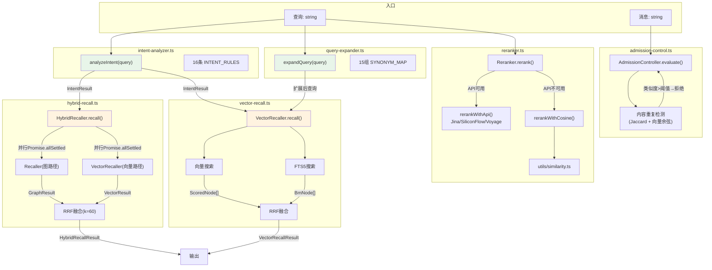

### 数据流步骤

| 步骤 | 模块 | 输入类型 | 输出类型 | 说明 |
|------|------|---------|---------|------|
| 1 | `analyzeIntent(query)` | `string` | `IntentResult{intent, scores}` | 6 类意图，16 条正则规则 |
| 2 | `expandQuery(query)` | `string` | `string` | 匹配同义词条目 → 追加 expansion terms |
| 3a | `HybridRecaller.recall()` | `query, scopeFilter` | `HybridRecallResult` | `Promise.allSettled` 并行图+向量 |
| 3b | `VectorRecaller.recall()` | `query, scopeFilter` | `VectorRecallResult` | 向量搜索 + FTS5 → RRF(k=60) 融合 |
| 4 | `Reranker.rerank(query, vec, nodes)` | `string, number[], BmNode[]` | `RerankResult` | API→60%重排+40%原始 / 余弦回退 |
| 5 | `AdmissionController.evaluate()` | `{name,content,category,vector}` | `AdmissionResult` | 长度→类别先验→名称Jaccard→向量余弦 |

### 关键设计决策

1. **Hybrid 独立于 Graph**：`HybridRecaller` 内部新建 `Recaller` 和 `VectorRecaller` 实例，不依赖 `ContextEngine`
2. **RRF 常数 k=60**：两组搜索结果是独立排序的，RRF 为两者提供可比分数
3. **准入控制默认关闭**：`DEFAULT_ADMISSION_CONFIG.enabled=false`，按需开启

---

## L1-4 · graph/ 图算法模块

### 文件组成与依赖

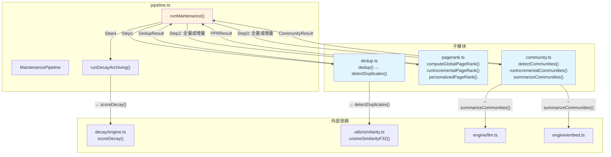

### 数据流步骤（pipeline.ts 主流程）

| 步骤 | 函数 | 输入类型 | 输出类型 | 说明 |
|------|------|---------|---------|------|
| 1 | `shouldRunIncremental(storage)` | `IStorageAdapter` | `boolean` | 脏节点比 <10% → 增量 |
| 2 | `dedup(storage, cfg)` | `IStorageAdapter, BmConfig` | `DedupResult` | LSH 桶 → 余弦相似度 → 合并节点 |
| 3a | `computeGlobalPageRank(storage, cfg)` | `IStorageAdapter, BmConfig` | `GlobalPRResult` | 全量迭代 20 次，写入 storage |
| 3b | `runIncrementalPageRank(storage, cfg)` | `IStorageAdapter, BmConfig` | `IncrementalPRResult` | 脏节点子图上迭代，边界固定 |
| 4a | `detectCommunities(storage)` | `IStorageAdapter` | `CommunityResult` | 全量 LPA 迭代 ≤50 次 |
| 4b | `runIncrementalCommunities(storage)` | `IStorageAdapter` | `IncrementalCR` | 冻结干净节点，脏节点局部 LPA |
| 5 | `summarizeCommunities(storage, comms, llm, embed)` | `IStorageAdapter, Map, CompleteFn, EmbedFn` | `number` | LLM 生成社区摘要 + Embedding |
| 6 | `runDecayArchiving(storage, cfg)` | `IStorageAdapter, BmConfig` | `number` | composite<0.25 且 validated≤1 → 标记 deprecated |

### 关键设计决策

1. **增量阈值 10%**：脏节点比例 <10% 走增量路径，避免全量重算的性能开销
2. **LSH 去重**：用符号随机投影构建桶，将 O(n²) 比较降为 O(n × bucket_size)
3. **PageRank 图缓存**：60s TTL 的全局图结构缓存，避免每次 PPR 都重建邻接表
4. **LPA 迭代上限 50 次**：大多数图在 5-15 次内收敛；单节点社区被合并到多节点社区后重命名

---

## L1-5 · reflection/ 反思模块

### 文件组成

| 文件 | 角色 |
|------|------|
| `extractor.ts` | 双模式反思：轮次反思（轻量）+ 会话反思（重量） |
| `store.ts` | 洞察持久化：映射为 BmNode + importance 提升 |
| `prompts.ts` | 反思提示词 |

### 数据流图

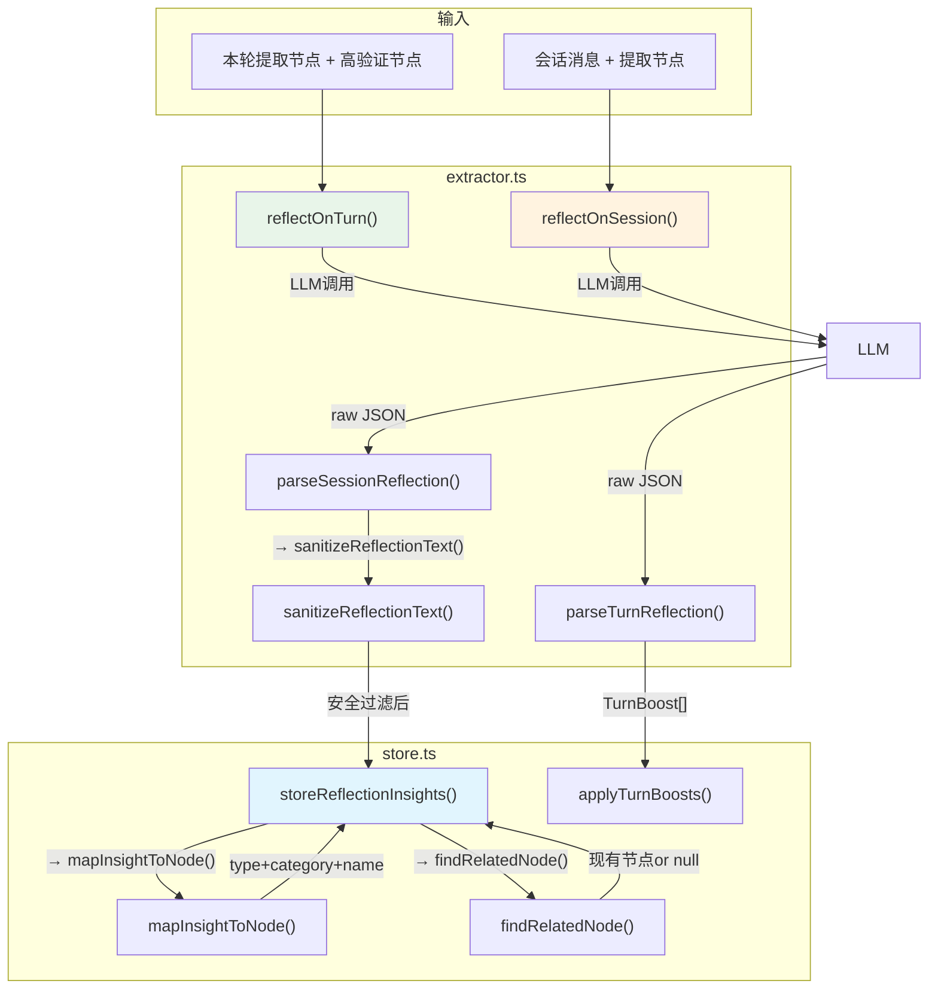

### 数据流步骤

| 步骤 | 函数 | 输入类型 | 输出类型 | 说明 |
|------|------|---------|---------|------|
| 1a | `reflectOnTurn(cfg, llm, params)` | `ReflectionConfig, CompleteFn, {nodes}` | `TurnBoost[]` | 轮次反思，扫描提取结果 |
| 1b | `reflectOnSession(cfg, llm, params)` | `ReflectionConfig, CompleteFn, {messages,nodes}` | `ReflectionInsight[]` | 会话反思，LLM 全量分析 |
| 2 | `sanitizeReflectionText(text, enabled)` | `string, boolean` | `string` | 6 种 prompt injection 模式过滤 |
| 3 | `storeReflectionInsights(storage, insights, sessionId, cfg)` | `IStorageAdapter, ReflectionInsight[], string, BmConfig` | `{stored, boosted}` | 映射为节点（user-model→profile, agent-model/lesson→cases, decision→events），或提升已有节点 importance |
| 4 | `applyTurnBoosts(storage, boosts)` | `IStorageAdapter, TurnBoost[]` | `number` | 直接更新节点 importance |

### 关键设计决策

1. **安全过滤优先**：反思内容经过 6 条 prompt injection 正则检测，命中则丢弃
2. **洞察节点化**：反思结果存为图节点（非纯文本），使其参与 PPR 排序、社区检测和衰减
3. **已有节点 importance 提升**：若洞察内容与现有节点 Jaccard > 0.15，不新建节点而是提升其 importance
4. **轮次反思可关闭**：默认 `turnReflection: false`，仅 `sessionReflection: true`

---

## L1-6 · fusion/ 融合模块

### 文件组成

| 文件 | 角色 |
|------|------|
| `analyzer.ts` | 完整融合管道：阈值检查 → 候选发现 → LLM 决策 → 执行 |
| `prompts.ts` | 融合决策提示词 |

### 数据流图

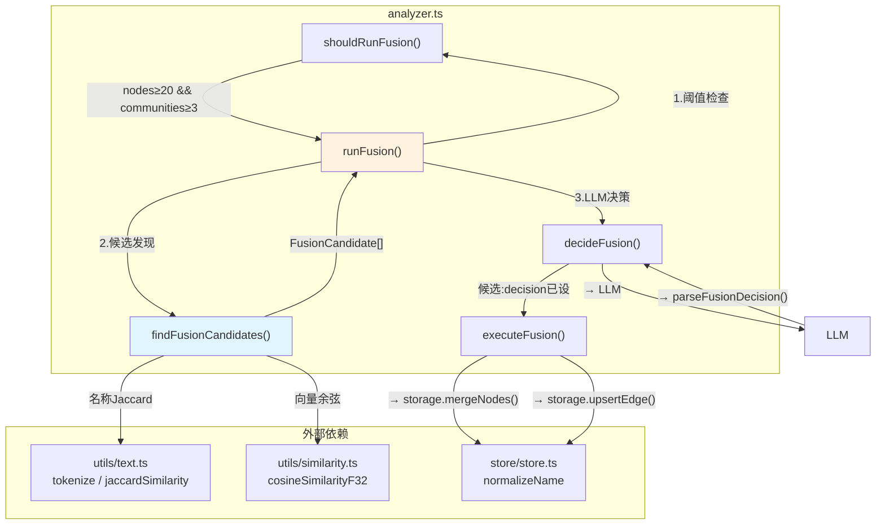

### 数据流步骤

| 步骤 | 函数 | 输入类型 | 输出类型 | 说明 |
|------|------|---------|---------|------|
| 1 | `shouldRunFusion(storage, cfg)` | `IStorageAdapter, BmConfig` | `boolean` | 活跃节点≥20 且社区≥3 → 触发 |
| 2 | `findFusionCandidates(storage, cfg, embedFn)` | `IStorageAdapter, BmConfig, EmbedFn?` | `FusionCandidate[]` | 同类型节点两两比较：名称 Jaccard × nameWeight + 向量余弦 × vectorWeight |
| 3 | `decideFusion(llm, candidates)` | `CompleteFn, FusionCandidate[]` | `FusionCandidate[]` | top20 候选送入 LLM，每对决定 merge/link/none |
| 4 | `executeFusion(storage, candidates, sessionId)` | `IStorageAdapter, FusionCandidate[], string` | `{merged, linked}` | merge → mergeNodes()；link → upsertEdge(REQUIRES) |

### 关键设计决策

1. **两级过滤**：`namePreFilterThreshold=0.2` 快速筛掉不相关对，减少向量比较次数
2. **LLM 不可用回退**：无 LLM 时 `combinedScore≥0.95→merge, ≥0.85→link`
3. **执行阶段消费去重**：用 `consumed Set` 跟踪已处理的节点 ID，防止一个节点被多次合并
4. **社区共现增强**：跨社区的候选对优先 link 而非 merge（保持社区结构）

---

## L1-7 · reasoning/ 推理模块

### 文件组成

| 文件 | 角色 |
|------|------|
| `engine.ts` | 推理引擎：阈值检查 → 子图构建 → LLM 推理 → 结论解析 |
| `prompts.ts` | 推理提示词 |

### 数据流图

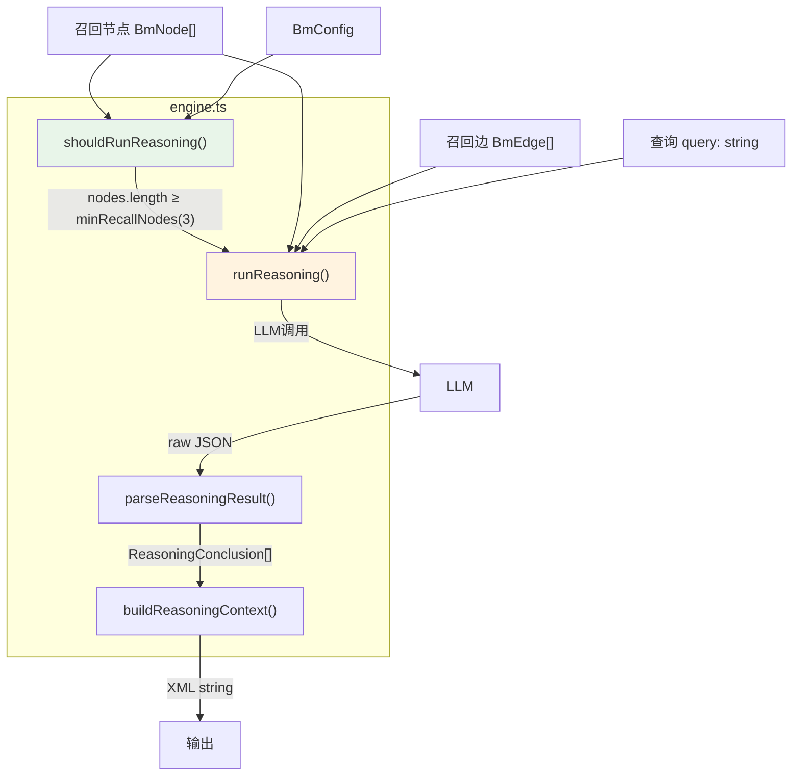

### 数据流步骤

| 步骤 | 函数 | 输入类型 | 输出类型 | 说明 |
|------|------|---------|---------|------|
| 1 | `shouldRunReasoning(nodes, cfg)` | `BmNode[], BmConfig` | `boolean` | 召回节点数 ≥ `minRecallNodes`(默认3) → 触发 |
| 2 | `runReasoning(llm, nodes, edges, query, cfg)` | `CompleteFn, BmNode[], BmEdge[], string, BmConfig` | `ReasoningResult` | 节点+边→LLM 推理 |
| 3 | `parseReasoningResult(raw, maxConclusions)` | `string, number` | `ReasoningConclusion[]` | 容错 JSON 解析 → 4 类结论 |
| 4 | `buildReasoningContext(conclusions)` | `ReasoningConclusion[]` | `string \| null` | 格式化为 XML `<reasoning>` 标签 |

### 四类推理结论

| 类型 | 含义 | 典型场景 |
|------|------|---------|
| `path` | 路径推导 A→B→C | "用户使用 Docker 部署 → Docker 需要 GPU → 所以需要 nvidia-docker" |
| `implicit` | 隐含关系（共享邻居） | "A 和 B 都连接到 C → 隐含 A 与 B 相关" |
| `pattern` | 模式泛化（多节点显示相似模式） | "3 次部署都失败 → 部署流程存在系统性问题" |
| `contradiction` | 矛盾检测 | "节点 A 说用 MySQL，节点 B 说用 PostgreSQL → 矛盾" |

### 关键设计决策

1. **仅在召回足够时触发**：`minRecallNodes=3`，避免无上下文时的幻觉
2. **small 模式提示词**：`REASONING_SYS_SMALL ~140 tokens`，适配小模型

---

## L1-8 · decay/ 衰减模块

### 文件组成

| 文件 | 角色 |
|------|------|
| `engine.ts` | Weibull 衰减引擎：分数计算 + 检索时衰减乘数 |
| `presets.ts` | 四种预设 + 衰减曲线可视化 |

### 数据流图

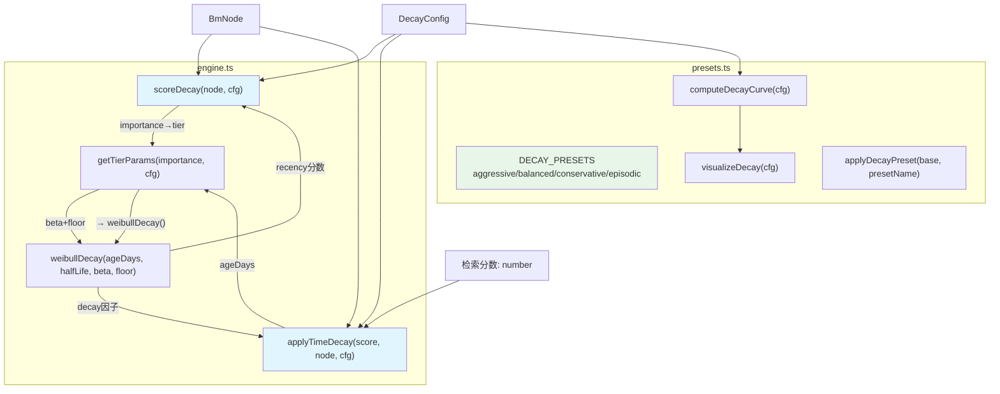

### 数据流步骤

| 步骤 | 函数 | 输入类型 | 输出类型 | 说明 |
|------|------|---------|---------|------|
| 1 | `scoreDecay(node, cfg)` | `BmNode, DecayConfig` | `DecayScore{recency,frequency,intrinsic,composite}` | 评估记忆质量：三因子加权 |
| 2 | `applyTimeDecay(score, node, cfg)` | `number, BmNode, DecayConfig` | `number` | 检索时的时间衰减乘数：`score × (0.5 + 0.5 × decay)` |
| 3 | `getTierParams(importance, cfg)` | `number, DecayConfig` | `{beta, floor}` | importance>0.7→core, >0.4→working, ≤0.4→peripheral |
| 4 | `weibullDecay(ageDays, halfLife, beta, floor)` | `number×4` | `number` | Weibull 衰减公式 |
| 5 | 维护时归档：`composite<0.25 && validated≤1` → `storage.deprecateNode()` | | | 低质量且低验证 → 软删除 |

### 三种衰减层级

| Tier | importance 范围 | β 值 | floor 值 | 特征 |
|------|----------------|------|---------|------|
| Core | > 0.7 | 0.8 (慢衰减) | 0.9 | 核心知识，几乎不衰减 |
| Working | 0.4~0.7 | 1.0 (中等) | 0.7 | 工作中的知识 |
| Peripheral | ≤ 0.4 | 1.3 (快衰减) | 0.5 | 边缘知识，快速衰减 |

### 关键设计决策

1. **动态记忆 3x 加速**：`temporalType='dynamic'` → `effectiveHalfLife = timeDecayHalfLifeDays / 3`
2. **检索时软衰减**：`score × (0.5 + 0.5 × decay)` — 不直接丢弃，而是降权
3. **维护时硬归档**：`composite < 0.25` 且 `validatedCount ≤ 1` → 标记 deprecated

---

## L1-9 · noise/ 噪声过滤模块

### 文件组成

| 文件 | 角色 |
|------|------|
| `filter.ts` | 双场景过滤：提取前过滤 + 召回前过滤 |

### 数据流

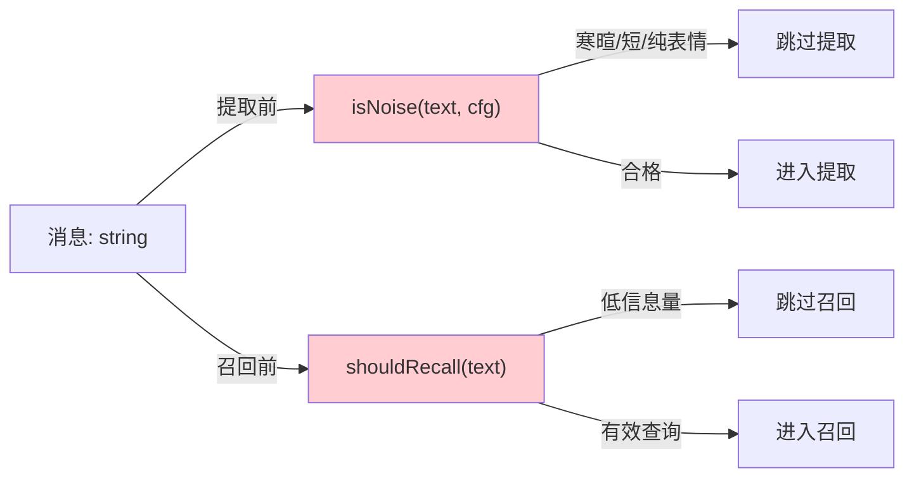

### 过滤规则对比

| 场景 | 函数 | 触发条件 |
|------|------|---------|
| 提取前 | `isNoise()` | `< minContentLength(10)` / 匹配 greeting/thanks/noise 正则 / 纯 emoji |
| 召回前 | `shouldRecall()` | `< 3 chars` / 低信息模式("好的""嗯""继续") / 纯 emoji / greetings <15 chars |

### 关键设计决策

1. **两阶段独立过滤**：提取过滤更严格（最小10字符），召回过滤更宽松（最少3字符+跳过确认类回复）
2. **纯规则无 LLM**：零延迟，不影响主流程

---

## L1-10 · temporal/ 时间分类模块

### 文件组成

| 文件 | 角色 |
|------|------|
| `classifier.ts` | 静态/动态分类器 |

### 数据流

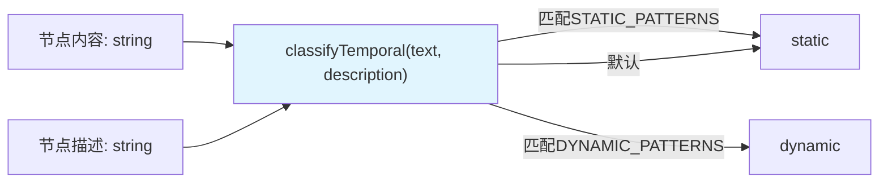

### 匹配规则

| 类别 | 触发模式 | 示例 |
|------|---------|------|
| STATIC | 定义/概念/原理/方法/偏好/恒常事实 | "algorithm", "how to", "always", "definition" |
| DYNAMIC | 时间相对表达/版本号/状态/临时修复/截止日期 | "currently", "version 2.0", "broken", "deadline" |

### 关键设计决策

1. **保守默认**：默认 `static`，仅当明确匹配动态模式时标记 `dynamic`（宁可漏标，不误标）
2. **静态优先**：先检查静态模式，再检查动态模式

---

## L1-11 · working-memory/ 工作记忆模块

### 文件组成

| 文件 | 角色 |
|------|------|
| `manager.ts` | 工作记忆 CRUD + 上下文构建 |

### 数据流图

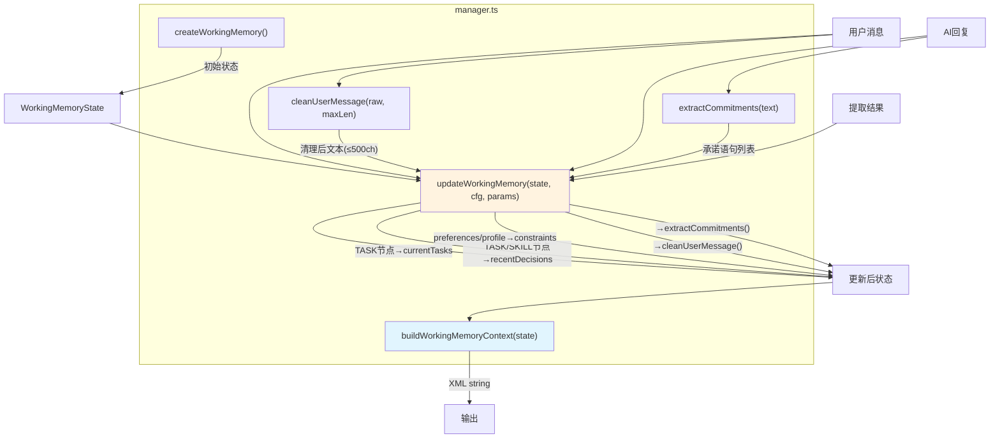

### WorkingMemoryState 五维结构

| 字段 | 来源 | 上限 | 说明 |
|------|------|------|------|
| `currentTasks` | 从本轮提取的 TASK 节点名 | maxTasks=3 | 最新任务前置 |
| `recentDecisions` | 从本轮提取的 TASK/SKILL 节点名 | maxDecisions=5 | 新决策前置 + 去重 |
| `constraints` | 从本轮提取的 preferences/profile 节点内容 | maxConstraints=5 | 截取前100字符 |
| `attention` | 用户消息经 cleanUserMessage() 清理 | - | 智能截断到句子边界 |
| `recentCommitments` | AI 回复中匹配 20 种承诺关键词的句子 | maxDecisions=5 | "I will", "recommend", "let me" 等 |

### 关键设计决策

1. **零 LLM 依赖**：完全从结构化提取结果推导，无需额外 LLM 调用
2. **新数据前置**：新任务/决策始终排在前面（reverse + concat）
3. **智能截断**：`cleanUserMessage()` 在句子边界截断，而非硬截取

---

## L1-12 · format/ 上下文组装模块

### 文件组成

| 文件 | 角色 |
|------|------|
| `assemble.ts` | 记忆 → XML 格式化 + Token 预算控制 |

### 数据流图

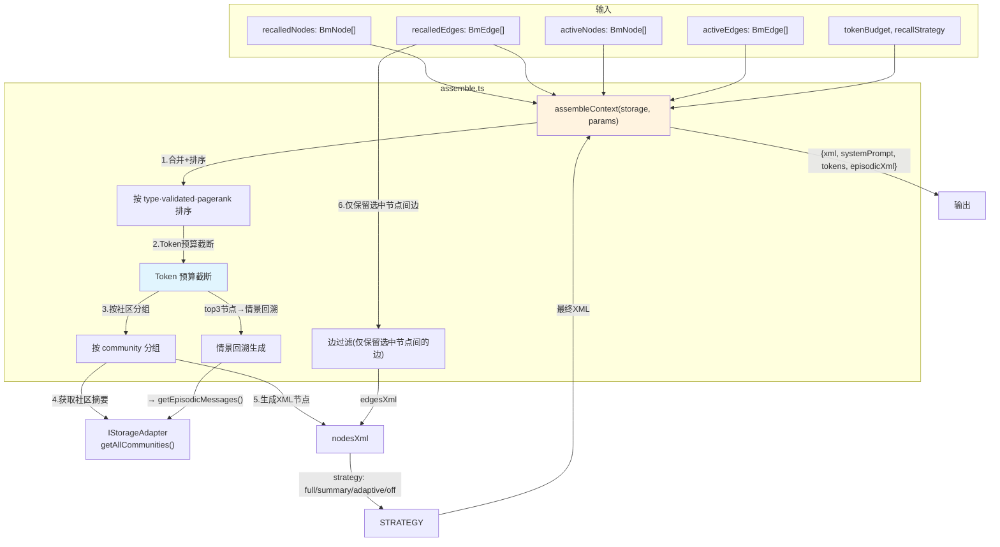

### 四种注入策略

| 策略 | 行为 | 适用场景 |
|------|------|---------|
| `full` | 完整 XML（name + desc + 完整 content） | 高信息量场景 |
| `summary` | 仅 name + desc（无 content） | 节省 Token |
| `adaptive` | ≤6 节点 → full；>6 节点 → summary | **默认策略** |
| `off` | 不注入任何记忆 | 完全关闭 |

### 排序优先级

```
src(recalled + active → active优先)
  → type(SKILL=3 > TASK=2 > EVENT=1)
  → validatedCount 降序
  → pagerank 降序
```

### 关键设计决策

1. **Token 预算强制**：`estimateNodeTokens()` 逐个估算，超预算则截断
2. **情景回溯**：top3 节点各拉取 2 个源会话的消息片段（≤500ch），放在 `<episodic_context>` 中
3. **社区分组**：memory 按 `communityId` 分组的 XML 结构使LLM 更容易理解记忆之间的关联

---

## L1-13 · scope/ 作用域隔离模块

### 文件组成

| 文件 | 角色 |
|------|------|
| `isolation.ts` | 六层 scope 匹配 + SQL WHERE 子句生成 + cross-scope sharing |

### 数据流图

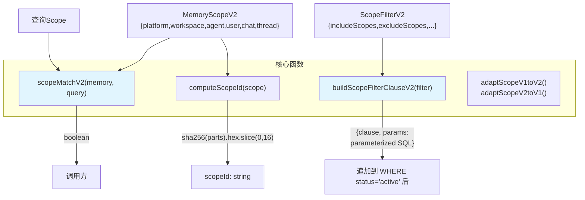

### 六层 Scope 匹配语义

```
查询 scope 是记忆 scope 的前缀 → 匹配
记忆: {platform:'qqbot', agent:'main', chat:'c1', thread:'t1'}
查询: {platform:'qqbot', agent:'main', chat:'c1'}   → ✅ 前缀匹配
查询: {platform:'discord', agent:'main'}              → ❌ platform 不同

NULL = "未限定"，匹配任意值
```

### SQL 子句生成逻辑

| 操作 | SQL 逻辑 | 示例 |
|------|---------|------|
| includeScopes (OR) | `(col = ? OR col IS NULL)` 各层 AND | `scope_platform='qqbot' AND scope_agent='main'` |
| excludeScopes (AND) | `(col != ? OR col IS NULL)` 各层 OR | `scope_platform!='discord' OR scope_platform IS NULL` |
| cross-scope sharing | mixed: 仅共享类别的节点 / shared: 不限制 | `category IN ('profile','preferences')` |

### 关键设计决策

1. **前缀匹配语义**：查询不需要填满六层——查询只有 platform+agent 时，记忆的 user/chat/thread 层不影响匹配
2. **参数化 SQL**：`buildScopeFilterClauseV2()` 返回 `{clause, params}`，防 SQL 注入
3. **scope_id hash**：`sha256(六层串接).hex.slice(0,16)`，快速等值匹配

---

## L1-14 · session/ 会话压缩模块

### 文件组成

| 文件 | 角色 |
|------|------|
| `compressor.ts` | 会话价值评估 + LLM 压缩 |

### 数据流

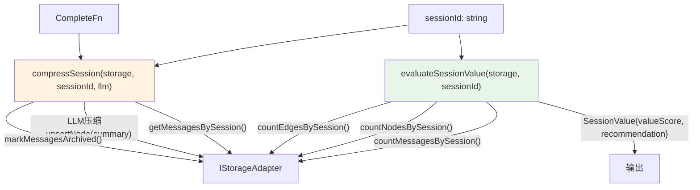

### 压缩建议阈值

| 条件 | 建议 |
|------|------|
| valueScore < 0.1 且 messages > 50 | archive（归档） |
| valueScore < 0.2 且 messages > 20 | compress（压缩） |
| 其他 | keep（保留） |

---
⚠️ **内容过长，分段继续**

## L1-15 · plugin/ 插件模块

### 文件组成

| 文件 | 角色 |
|------|------|
| `core.ts` | BrainMemoryPluginCore：OpenClaw 插件生命周期实现 |
| `hooks.ts` | HookRegistry：6 类开发者钩子的类型定义和注册容器 |

### 数据流图

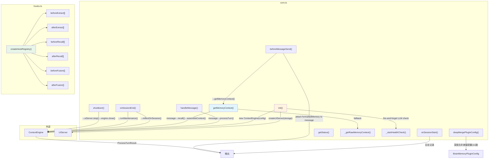

### 数据流步骤

| 步骤 | 函数 | 输入类型 | 输出类型 | 触发时机 |
|------|------|---------|---------|---------|
| 1 | `init()` | - | `void` | 插件激活时 |
| 2 | `onSessionStart(event)` | `SessionEvent` | `void` | 会话创建时（日志记录） |
| 3 | `handleMessage(message)` | `Message` | `Message \| null` | 每条用户消息 → processTurn |
| 4a | `getMemoryContext(message)` | `Message` | `MemoryContextResult \| null` | 需要记忆上下文时 → recall + assemble |
| 4b | `beforeMessageSend(message)` | `Message` | `Message` | 消息发送前 → 注入记忆 |
| 5 | `onSessionEnd(event)` | `SessionEvent` | `void` | 会话结束时 → reflection + maintenance |
| 6 | `shutdown()` | - | `void` | 插件卸载时 |

### 配置深度合并（11 个嵌套键）

```
decay, reflection, workingMemory, fusion, reasoning,
memoryInjection, memorySharing, noiseFilter, rerank, embedding, llm
```

### 6 类 Hook 覆盖的生命周期点

| Hook 类型 | 注册字段 | 触发节点 |
|-----------|---------|---------|
| beforeExtract | `hooks.beforeExtract[]` | `ExtractionService.processTurn()` 调用 Extractor 前 |
| afterExtract | `hooks.afterExtract[]` | `ExtractionService.processTurn()` 提取完成后 |
| beforeRecall | `hooks.beforeRecall[]` | `RecallService.recall()` 调用 Recaller 前 |
| afterRecall | `hooks.afterRecall[]` | `RecallService.recall()` 召回完成后 |
| beforeFusion | `hooks.beforeFusion[]` | `FusionService.run()` 融合前 |
| afterFusion | `hooks.afterFusion[]` | `FusionService.run()` 融合完成后 |

### 关键设计决策

1. **双模式记忆获取**：`getMemoryContext()` 优先使用 `assembleContext` 格式化注入；回退到 `_getRawMemoryContext()` 返回原始 BmNode[]
2. **健康检查 fire-and-forget**：`init()` 中启动 1s 延迟的 LLM ping，超时 3s 自动 abort，不阻塞插件启动
3. **Hook 错误隔离**：每个 Hook 用 try-catch 包裹，hook 抛出异常不影响主流程

---

## L1-16 · store/ 存储模块

### 文件组成

| 文件 | 角色 |
|------|------|
| `adapter.ts` | IStorageAdapter 接口定义（~40 方法） + StorageFilter/ScoredNode 等传输类型 |
| `sqlite-adapter.ts` | SQLiteStorageAdapter：IStorageAdapter 的 SQLite 实现 |
| `db.ts` | SQLite Schema（6 表 + FTS5 + 触发器 + 索引）+ initDb() |
| `migrate.ts` | 数据库迁移系统（v0→v1→v2 scope 升级） |
| `store.ts` | Barrel 统一导出 |
| `storage/_helpers.ts` | `toNode()` / `toEdge()` / `normalizeName()` / `uid()` |
| `storage/nodes.ts` | 节点 CRUD（upsert/deprecate/merge/pagerank/community/access） |
| `storage/edges.ts` | 边 CRUD（upsert/edgesFrom/edgesTo） |
| `storage/search.ts` | FTS5 搜索 + LIKE 回退 + 向量搜索 + topNodes |
| `storage/vectors.ts` | 向量存储（saveVector/getVector/getVectorHash/getAllVectors） |
| `storage/messages.ts` | 消息 CRUD（save/getUnextracted/markExtracted/getEpisodic） |
| `storage/communities.ts` | 社区摘要 CRUD（upsert/get/getAll/prune/vectorSearch/nodesByCommunities） |
| `storage/graph-walk.ts` | 图遍历 + 社区向量搜索 + 社区节点查询 |

### 数据流图

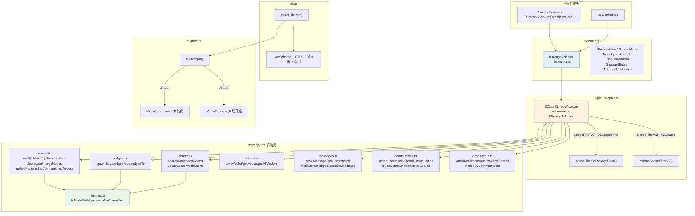

### 数据流步骤（写入路径示例：upsertNode）

| 步骤 | 层 | 函数 | 数据类型变化 |
|------|---|------|-------------|
| 1 | Service | `ExtractionService` | `extracted node data` → `NodeUpsertInput` |
| 2 | Adapter | `SQLiteStorageAdapter.upsertNode(input, sessionId)` | `NodeUpsertInput` → `{node, isNew}` |
| 3 | Storage | `nodes.ts/upsertNode(db, input, sessionId)` | `NodeUpsertInput` → SQL INSERT/UPDATE |
| 4 | Storage | `nodes.ts/findByName(db, name)` | 检查现有节点是否存在 |
| 5 | Helper | `_helpers.ts/normalizeName(name)` | `string → string`（小写、去空格） |
| 6 | Helper | `_helpers.ts/toNode(row)` | `SqlRow → BmNode` |
| 7 | Adapter | 返回 | `BmNode` → `{node: BmNode, isNew: boolean}` |

### 读取路径示例（searchNodes + scope 过滤）

| 步骤 | 层 | 函数 | 数据类型变化 |
|------|---|------|-------------|
| 1 | Service | `RecallService` | `query: string` → 传入 Adapter |
| 2 | Adapter | `SQLiteStorageAdapter.searchNodes(query, limit, filter)` | `StorageFilter → ScopeFilter + ScopeFilterV2` |
| 3a | Scope | `buildScopeFilterClauseV2(filterV2)` | `ScopeFilterV2 → {clause, params}` |
| 3b | Scope | `buildScopeFilterClause(filterV1)` | `ScopeFilter → {clause, params}` |
| 4 | Storage | `search.ts/searchNodes(db, query, limit, scope)` | SQL FTS5 → LIKE回退 → `SqlRow[]` |
| 5 | Helper | `_helpers.ts/toNode(row)` | `SqlRow → BmNode` |
| 6 | Adapter | 返回 | `BmNode[]` |

### 数据库迁移路径

```
v0 (无 bm_meta 表)
  → migrate() 创建 bm_meta + 设 version=1

v1 (有三层 scope: scope_session/scope_agent/scope_workspace)
  → migrateToV2_ScopeUpgrade()
    1. 新增 scope_platform/scope_user/scope_chat/scope_thread/scope_id 列
    2. 旧数据: scope_session → scope_chat
    3. JS 逐行计算 scope_id (sha256 → hex.slice(0,16))
    4. 建 scope 索引
    5. 设 version=2
```

### 关键设计决策

1. **Barrel 导出模式**：`store.ts` 统一导出所有子模块，消费者无感知文件拆分
2. **FTS5 + LIKE 双路径搜索**：FTS5 对英文友好但中文分词差 → FTS5 失败/无结果回退 LIKE
3. **向量存储独立表**：`bm_vectors` 独立于 `bm_nodes`，允许节点无嵌入向量（LLM/Embedding 未配置时）
4. **source_sessions JSON 数组**：`sourceSessions` 存储为 TEXT JSON 数组字符串，应用层 parse
5. **事务安全**：`mergeNodes()` 等复杂操作在 transaction 中执行
6. **scope 迁移兼容**：v2 迁移幂等（列已存在则跳过），不影响已有 v1 数据


## L1-17 · ui/ Web Control UI 子系统

### 文件组成

| 文件 | 角色 |
|------|------|
| `server.ts` | 嵌入式 HTTP + WebSocket 服务器：Hono 路由 + Node.js http.Server + ws.WebSocketServer + EventEmitter 事件总线 |
| `controllers/stats.ts` | GET /api/stats, GET /api/stats/decay → 存储统计 + 衰减可视化 |
| `controllers/nodes.ts` | GET/POST/PUT/DELETE /api/nodes, POST /api/nodes/merge → CRUD + WebSocket 通知 |
| `controllers/graph.ts` | GET /api/graph, GET /api/graph/community/:id → 全量图谱 + 社区子图 |
| `controllers/config.ts` | GET/PUT /api/config → 配置读写(openclaw.json) + 原子写 + .bak 备份 |
| `middleware/auth.ts` | Bearer Token / Query Token 认证中间件 |

### 架构特点

UI 子系统是**唯一直接持有 `IStorageAdapter` 引用**的消费者，**绕过所有 Domain Service 层**：

```
HTTP Request
  → Hono route matching
  → auth middleware (token 校验，未配置则放行)
  → Controller handler
  → IStorageAdapter (直连，不经 ExtractionService / RecallService 等)
  → JSON Response

存储变更事件
  → EventEmitter.emit('node:created', ...) / emit('stats:updated', ...)
  → broadcast() 函数
  → ws.WebSocketServer → 所有活跃 WebSocket 客户端
```

### 数据流图

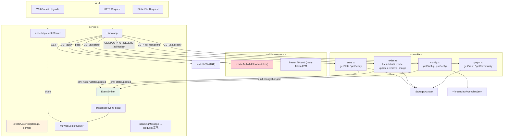

### 数据流步骤

#### 读取路径（以 GET /api/nodes 为例）

| 步骤 | 层 | 数据类型变化 |
|------|---|------------|
| 1 | Hono | `URL query params` → `{ limit, offset, search, category, sort, order }` |
| 2 | Controller | `storage.findAllActive()` → `BmNode[]` |
| 3 | Controller | 分类过滤(`category.split(',')`) → 文本搜索(`includes`) → 排序(`pagerank/importance/updated`) → 分页(`slice`) |
| 4 | Controller | 简化映射 → `rows[] { id, type, category, name, description(≤200ch), status, pagerank, importance, ... }` |
| 5 | Hono | `c.json({ total, limit, offset, nodes })` → HTTP 200 JSON |

#### 写入路径（以 POST /api/nodes 为例）

| 步骤 | 层 | 数据类型变化 |
|------|---|------------|
| 1 | Hono | `HTTP Body JSON` → `{ type, category, name, description, content, scope* }` |
| 2 | Controller | 构造 `NodeUpsertInput` (source='manual') |
| 3 | Storage | `storage.upsertNode(input, 'manual')` → `{ node: BmNode, isNew }` |
| 4 | Controller | `eventBus.emit('node:created', { node })` |
| 5 | Controller | `eventBus.emit('stats:updated', storage.getStats())` |
| 6 | Server | `broadcast()` → WebSocket JSON `{ event, data, timestamp }` |

#### 配置写入路径（PUT /api/config）

| 步骤 | 层 | 数据类型变化 |
|------|---|------------|
| 1 | Controller | `HTTP Body JSON` → 深度合并到 `openclaw.json` 的 `plugins.entries['brain-memory'].config` 下 |
| 2 | Controller | `copyFileSync(configPath, bakPath)` → .bak 备份 |
| 3 | Controller | `writeFileSync(tmpPath)` → `renameSync(tmpPath, configPath)` → 原子写 |
| 4 | Controller | `eventBus.emit('config:changed', { diff, requiresRestart: true })` |
| 5 | Hono | `c.json({ saved: true, message: '配置已保存，重启 Gateway 后生效' })` |

### 事件总线消息格式

```typescript
// WebSocket broadcast message 格式
{
  event: 'connected' | 'stats:updated' | 'node:created'
       | 'node:updated' | 'node:deprecated' | 'config:changed',
  data: unknown,          // 事件相关的 payload
  timestamp: number       // Date.now()
}
```

| 事件 | payload 类型 | 触发来源 |
|------|-------------|---------|
| `connected` | `{ timestamp }` | 客户端 WebSocket 连接建立 |
| `stats:updated` | `StorageStats` | node CRUD / merge 后 |
| `node:created` | `{ node: BmNode }` | POST /api/nodes |
| `node:updated` | `{ node: BmNode, changes: string[] }` | PUT /api/nodes/:id |
| `node:deprecated` | `{ nodeId: string }` | DELETE /api/nodes/:id |
| `config:changed` | `{ diff: string[], requiresRestart: true }` | PUT /api/config |

### 认证流程

```mermaid
flowchart LR
    REQ["HTTP Request"]
    HAS_TOKEN{"authToken<br>已配置?"}
    EXTRACT["提取 token<br>Authorization: Bearer<br>or ?token="
    MATCH{"token<br>匹配?"}
    PASS["放行 → next()"]
    REJECT["401 Unauthorized"]

    REQ --> HAS_TOKEN
    HAS_TOKEN -->|false| PASS
    HAS_TOKEN -->|true| EXTRACT
    EXTRACT --> MATCH
    MATCH -->|true| PASS
    MATCH -->|false| REJECT

    style REJECT fill:#ffcdd2
    style PASS fill:#c8e6c9
```

### 关键设计决策

1. **绕过 Service 层**：UI 直接操作 `IStorageAdapter`，不经过 `RecallService`/`ExtractionService`——UI 是"只读+管理"界面，不需要记忆提取/召回语义
2. **WebSocket 复用 HTTP Server**：`ws.WebSocketServer({ server: httpServer })` 共享端口，无需额外端口
3. **配置原子写**：`writeFile(tmp) → rename(tmp, config)` 防止写入中断导致配置损坏
4. **认证跳过静态文件**：`/` 和 `/assets/*` 不经过 auth 中间件，确保前端页面可公开访问
5. **canvas 嵌入视图**：`GET /embed/dashboard` 读取 `ui/public/embed-dashboard.html`，专为 OpenClaw Canvas 系统设计
6. **分页上限**：nodes list `limit ≤ 200`，graph `maxNodes ≤ 500`，防止大图 OOM

---

# 第二部分：L2 — 服务级数据流

## L2 综述

L2 聚焦每个 Domain Service 与其依赖模块之间的交互关系。共覆盖 **7 个 Domain Service**。

---

## L2-1 · ExtractionService

### 依赖关系

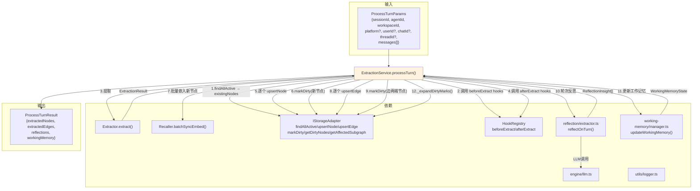

### 完整交互序列

| 序号 | 操作 | 调用对象 | 数据流 |
|------|------|---------|--------|
| 1 | 获取已有节点名 | `storage.findAllActive()` | → `BmNode[].map(n=>n.name)` |
| 2 | beforeExtract Hook | `hooks.beforeExtract[]` | `{messages, existingNames}` ↔ 可能被修改 |
| 3 | 知识提取 | `extractor.extract()` | `{messages, existingNames}` → `ExtractionResult` |
| 4 | afterExtract Hook | `hooks.afterExtract[]` | `ExtractionResult` ↔ 可观察/修改 |
| 5 | 写入节点 | `storage.upsertNode()` × N | `NodeUpsertInput` → `{node, isNew}` |
| 6 | 标记脏节点 | `storage.markDirty()` | `string[]` (节点 ID 列表) |
| 7 | 批量嵌入 | `recaller.batchSyncEmbed()` | `BmNode[]` → 向量写入 |
| 8 | 写入边 | `storage.upsertEdge()` × N | `EdgeUpsertInput` → `BmEdge` |
| 9 | 标记脏边 | `storage.markDirty()` | `string[]` (边两端节点 ID) |
| 10 | 轮次反思 | `reflectOnTurn()` | `{extractedNodes, existingNodes}` → `TurnBoost[]` |
| 11 | 工作记忆更新 | `updateWorkingMemory()` | `{extractedNodes, userMessage, assistantMessage}` → `WorkingMemoryState` |
| 12 | 扩展脏标记 | `_expandDirtyMarks()` → `getAffectedSubgraph(1)` | 脏节点 + 1-hop 邻居也标记为脏 |

### 数据形态变化链

```
messages[{role, content}]
  → noise filtered messages
  → ExtractionResult{nodes, edges}
  → NodeUpsertInput[] (forEach node)
  → BmNode[] (upserted)
  → Embedded vectors (via batchSyncEmbed)
  → BmEdge[] (upserted)
  → ReflectionInsight[] (turn reflection)
  → WorkingMemoryState (updated)
→ ProcessTurnResult{extractedNodes, extractedEdges, reflections, workingMemory}
```

---

## L2-2 · RecallService

### 依赖关系

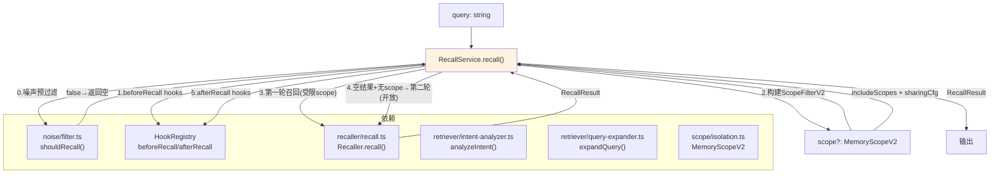

### 两轮回退逻辑

```
第一轮: 使用用户消息的 scope（platform+workspace+agent+chat）
  → 有结果 → 直接返回
  → 无结果且 scope 非空 → 第二轮: 开放跨域（allowCrossScope=true）
```

### 关键设计决策

1. **噪声预过滤在 Service 层**：`shouldRecall()` 在 `RecallService` 调用（不在 Recaller 内部），实现关注点分离
2. **两轮召回**：第一轮严格 scope → 无结果则开放召回，确保不遗漏无 scope 标记的旧数据

---

## L2-3 · MaintenanceService

### 依赖关系

```mermaid
flowchart TB
    MS["MaintenanceService.run()"]

    subgraph 依赖
        MAINT["graph/pipeline.ts<br>runMaintenance()"]
        STORE["IStorageAdapter"]
    end

    MS -->|"capabilities检查"| STORE
    MS -->|"委托runMaintenance()"| MAINT
    MAINT -->|"MaintenanceResult"| MS
    MS -->|"clearDirty()"| STORE

    style MS fill:#e8f5e9
```

### 交互序列

| 序号 | 操作 | 调用对象 |
|------|------|---------|
| 1 | 社区支持检查 | `storage.capabilities.communities` |
| 2 | 委托完整维护管线 | `runMaintenance(storage, cfg)` |
| 3 | 清除脏标记 | `storage.clearDirty()` |

---

## L2-4 · FusionService

### 依赖关系

```mermaid
flowchart TB
    FS["FusionService.run()"]

    subgraph 依赖
        ANALYZER["fusion/analyzer.ts<br>runFusion()"]
        STORE["IStorageAdapter"]
        HOOKS["HookRegistry<br>beforeFusion/afterFusion"]
        LLM["engine/llm.ts<br>createCompleteFn()"]
        EMBED["engine/embed.ts<br>createEmbedFn()"]
    end

    FS -->|"mode==lite或!enabled→返回空"| FS
    FS -->|"调用 beforeFusion hooks"| HOOKS
    FS -->|"委托完整融合管道"| ANALYZER
    ANALYZER -->|"FusionResult"| FS
    FS -->|"调用 afterFusion hooks"| HOOKS

    style FS fill:#e1f5fe
```

### 关键设计决策

1. **lite 模式跳过融合**：`mode === 'lite'` 时直接返回 `{candidates:[], merged:0, linked:0}`
2. **LLM + Embedding 在 Service 层创建**：`createCompleteFn(cfg.llm)` 和 `createEmbedFn(cfg.embedding)` 作为参数传入 `runFusion()`

---

## L2-5 · ReflectionService

### 依赖关系

```mermaid
flowchart TB
    RS["ReflectionService.run()"]

    subgraph 依赖
        EXTRACTOR["reflection/extractor.ts<br>reflectOnSession()"]
        STORE_REF["reflection/store.ts<br>storeReflectionInsights()"]
        STORE["IStorageAdapter"]
        LLM["engine/llm.ts<br>createCompleteFn()"]
    end

    RS -->|"mode/llm/capabilities检查"| RS
    RS -->|"过滤session节点"| STORE
    RS -->|"调用reflectOnSession()"| EXTRACTOR
    EXTRACTOR -->|"LLM调用"| LLM
    EXTRACTOR -->|"ReflectionInsight[]"| RS
    RS -->|"存储洞察"| STORE_REF
    STORE_REF -->|"→ upsertNode/updateImportance"| STORE

    style RS fill:#fff3e0
```

### 关键设计决策

1. **三重前置检查**：mode!=lite → llm 已配置 → storage 支持 reflections
2. **仅分析会话相关节点**：`findAllActive().filter(n => n.sourceSessions.includes(sessionId))`

---

## L2-6 · ReasoningService

### 依赖关系

```mermaid
flowchart TB
    RS["ReasoningService.run()"]

    subgraph 依赖
        ENGINE["reasoning/engine.ts<br>runReasoning()"]
        STORE["IStorageAdapter"]
        LLM["engine/llm.ts<br>createCompleteFn()"]
    end

    RS -->|"mode/llm检查"| RS
    RS -->|"获取全量节点+边"| STORE
    STORE -->|"BmNode[] + BmEdge[]"| RS
    RS -->|"委托runReasoning()"| ENGINE
    ENGINE -->|"LLM调用"| LLM
    ENGINE -->|"ReasoningResult"| RS

    style RS fill:#e8f5e9
```

### 关键设计决策

1. **全量节点入参**：推理使用 `storage.findAllActive()` 全部节点，不限于召回子集
2. **最小节点阈值**：`nodes.length ≥ minRecallNodes(3)` 才触发 LLM 推理

---

## L2-7 · HealthService

### 依赖关系

```mermaid
flowchart TB
    HS["HealthService"]

    subgraph 提供的方法
        STATS["getStats() → EngineStats"]
        HEALTH["healthCheck() → HealthStatus"]
        NODES["getAllActiveNodes() → BmNode[]"]
        SEARCH["searchNodes() → BmNode[]"]
        GET_STORE["getStorage() → IStorageAdapter"]
    end

    subgraph 依赖
        STORE["IStorageAdapter<br>getStats/isConnected/findAllActive/searchNodes"]
        EMBED_CACHE["engine/embed.ts<br>getEmbedCacheStats()"]
        FS["node:fs: existsSync/statSync"]
    end

    HS --> STATS
    HS --> HEALTH
    HS --> NODES
    HS --> SEARCH
    HS --> GET_STORE

    STATS --> STORE
    STATS --> EMBED_CACHE
    STATS --> FS

    HEALTH --> STORE

    style HS fill:#e3f2fd
```

### EngineStats 完整维度

| 维度 | 来源 |
|------|------|
| `nodeCount / edgeCount / sessionCount` | `storage.getStats()` |
| `nodes.byType {task, skill, event}` | `storage.getStats()` |
| `nodes.byCategory {8类}` | `storage.getStats()` |
| `nodes.byTemporalType {static, dynamic}` | `storage.getStats()` |
| `nodes.bySource {user, assistant}` | `storage.getStats()` |
| `communities / vectors` | `storage.getStats()` |
| `dbSizeBytes` | `fs.statSync(dbPath).size` |
| `schemaVersion` | `storage.getStats()` |
| `uptimeMs` | `Date.now() - createdAt` |
| `embedCache {size, hits, misses, hitRate}` | `getEmbedCacheStats()` |

### HealthStatus 三级判定

| 状态 | 条件 |
|------|------|
| `healthy` | DB ok + LLM ok + Embed ok |
| `degraded` | DB ok + (LLM 未配置 或 Embed 未配置) |
| `unhealthy` | DB 异常 |

---

# 第三部分：L3 — 端到端业务流程

## L3 综述

L3 串联 L1 和 L2 的所有组件，呈现 6 条完整的业务管道。每条管道标注每一步的数据形态变化。

---

## L3-1 · processTurn 管道（提取写入）

### 时序图

```mermaid
sequenceDiagram
    participant Caller as 调用方
    participant CE as ContextEngine
    participant ES as ExtractionService
    participant Hook as HookRegistry
    participant Ext as Extractor
    participant Heur as Heuristic
    participant LLM as LLM
    participant Store as IStorageAdapter
    participant Rec as Recaller
    participant Ref as Reflection
    participant WM as WorkingMemory

    Caller->>CE: processTurn(params)
    CE->>ES: processTurn(params)

    Note over ES: Step 1: 获取已有节点
    ES->>Store: findAllActive()
    Store-->>ES: BmNode[]

    Note over ES: Step 2: beforeExtract hooks
    ES->>Hook: beforeExtract hooks
    Hook-->>ES: modified {messages, existingNames}

    Note over ES: Step 3: 三级提取
    ES->>Ext: extract({messages, existingNames})
    Ext->>Heur: heuristicExtract(filtered)
    Heur-->>Ext: ExtractionResult (Tier1)
    Ext->>LLM: llm(system, user)
    LLM-->>Ext: raw JSON string
    Ext->>Ext: parseExtract(raw)
    Ext->>Ext: mergeResults(heuristic, llm)
    Ext-->>ES: ExtractionResult

    Note over ES: Step 4: afterExtract hooks
    ES->>Hook: afterExtract hooks

    Note over ES: Step 5-6: 写入节点 + 脏标记
    loop 每个节点
        ES->>Store: upsertNode(input, sessionId)
        Store-->>ES: {node: BmNode, isNew: boolean}
        ES->>Store: markDirty([node.id])
    end

    Note over ES: Step 7: 批量嵌入
    ES->>Rec: batchSyncEmbed(upsertedNodes)
    Rec->>Store: saveVector(nodeId, content, vec)

    Note over ES: Step 8-9: 写入边 + 脏标记
    loop 每个边
        ES->>Store: upsertEdge(input)
        Store-->>ES: BmEdge
        ES->>Store: markDirty([fromId, toId])
    end

    Note over ES: Step 10: 轮次反思 (LLM enabled)
    ES->>Ref: reflectOnTurn(cfg, llm, {nodes})
    Ref->>LLM: llm(system, prompt)
    LLM-->>Ref: raw JSON
    Ref-->>ES: TurnBoost[]

    Note over ES: Step 11: 工作记忆更新
    ES->>WM: updateWorkingMemory(state, cfg, params)
    WM-->>ES: WorkingMemoryState

    Note over ES: Step 12: 扩展脏标记
    ES->>Store: getAffectedSubgraph(1)
    Store-->>ES: {nodes, edges}
    ES->>Store: markDirty(expanded)

    ES-->>CE: ProcessTurnResult
    CE-->>Caller: {extractedNodes, extractedEdges, reflections, workingMemory}
```

### 数据形态变化表

| 阶段 | 形态 | 类型 |
|------|------|------|
| 入口 | 原始消息 | `ProcessTurnParams{messages: Array<{role,content}>}` |
| 噪声过滤后 | 有效消息 | `Array<{role, content, turn_index}>` |
| 提取结果 | 结构化知识 | `ExtractionResult{nodes[], edges[]}` |
| 写入存储 | 持久化节点 | `BmNode` (含 scope/importance/createdAt 等) |
| 嵌入后 | 向量化 | `Float32Array` 存入 `bm_vectors` |
| 反思后 | 洞察列表 | `ReflectionInsight[]` |
| 工作记忆 | 五维状态 | `WorkingMemoryState` |
| 出口 | 汇总结果 | `ProcessTurnResult` |

---

## L3-2 · recall 管道（记忆召回）

### 时序图

```mermaid
sequenceDiagram
    participant Caller as 调用方
    participant CE as ContextEngine
    participant RS as RecallService
    participant Noise as NoiseFilter
    participant Hook as HookRegistry
    participant Rec as Recaller
    participant Cache as RecallCache
    participant Intent as IntentAnalyzer
    participant Expand as QueryExpander
    participant Store as IStorageAdapter
    participant PPR as PageRank
    participant Decay as DecayEngine

    Caller->>CE: recall(query, scope)
    CE->>RS: recall(query, scope)

    Note over RS: Step 0: 噪声预过滤
    RS->>Noise: shouldRecall(query)
    alt 低信息量
        Noise-->>RS: false
        RS-->>CE: {nodes:[], edges:[], tokenEstimate:0}
    end

    Note over RS: Step 1: beforeRecall hooks
    RS->>Hook: beforeRecall hooks
    Hook-->>RS: modified query

    Note over RS: Step 2: 构建 ScopeFilterV2
    RS->>RS: includeScopes/excludeScopes + sharingConfig

    Note over Rec: Step 3: 缓存检查
    Rec->>Cache: isValid(storage)
    Cache->>Store: _computeContentHash()
    Rec->>Cache: get(query, scope, source)
    alt 缓存命中
        Cache-->>Rec: RecallResult
        Rec-->>RS: 缓存结果
    end

    Note over Rec: Step 4: 意图分析 + 查询扩展
    Rec->>Intent: analyzeIntent(query)
    Intent-->>Rec: IntentResult
    Rec->>Expand: expandQuery(query)
    Expand-->>Rec: expandedQuery

    Note over Rec: Step 5: 四路径种子获取
    par 路径1: 精确
        Rec->>Store: vectorSearchWithScore / searchNodes
        Store-->>Rec: BmNode[]
        Rec->>Store: findCommunityPeers(seed.id, 2)
        Store-->>Rec: string[]
    and 路径2: 泛化
        Rec->>Store: communityVectorSearch / findCommunityRepresentatives
        Store-->>Rec: BmNode[]
    and 路径3: 语义 (LanceDB)
        Rec->>Store: searchIndex.semanticSearch()
        Store-->>Rec: ScoredNode[]
    end

    Note over Rec: Step 6: 统一种子 + 图遍历
    Rec->>Rec: 四路径去重 + 路径位图
    Rec->>Store: graphWalk(unifiedSeeds, maxDepth)
    Store-->>Rec: {nodes, edges}

    Note over Rec: Step 7: 统一 PPR 排序
    Rec->>PPR: personalizedPageRank(storage, seeds, candidates, cfg)
    PPR-->>Rec: {scores: Map<string,number>}

    Note over Rec: Step 8: 分数融合
    Rec->>Decay: applyTimeDecay(score, node, cfg)
    Decay-->>Rec: decayed score
    Rec->>Rec: 多路径×1.2 + 时间敏感加权

    Note over Rec: Step 9: 排序截断 + 更新访问
    Rec->>Rec: sort → slice(topN)
    Rec->>Store: updateAccess(node.id) × N

    Note over Rec: Step 10: 缓存写入
    Rec->>Cache: set(query, result)

    Rec-->>RS: RecallResult
    Note over RS: Step 11: afterRecall hooks
    RS->>Hook: afterRecall hooks
    RS-->>CE: RecallResult
    CE-->>Caller: {nodes, edges, tokenEstimate}
```

### 数据形态变化表

| 阶段 | 形态 | 类型 |
|------|------|------|
| 入口 | 查询字符串 | `string` |
| 意图分析后 | 意图标签 | `IntentResult{intent, scores}` |
| 查询扩展后 | 扩展查询 | `string`（附加同义词） |
| 精确路径 | 种子节点ID | `string[]`（向量/FTS5→社区扩展） |
| 泛化路径 | 种子节点ID | `string[]`（社区向量匹配→成员） |
| 语义路径 | 种子节点ID | `string[]`（LanceDB） |
| 图遍历后 | 候选子图 | `{nodes: BmNode[], edges: BmEdge[]}` |
| PPR 后 | 带分数的节点 | `Map<string, number>` |
| 衰减后 | 降权分数 | `number`（×时间衰减 + ×多路径增强） |
| 出口 | 最终召回结果 | `RecallResult{nodes, edges, tokenEstimate}` |

---

## L3-3 · maintenance 管道（图维护）

### 时序图

```mermaid
sequenceDiagram
    participant Caller as 调用方
    participant CE as ContextEngine
    participant MS as MaintenanceService
    participant Pipe as MaintenancePipeline
    participant Dedup as Dedup
    participant PR as PageRank
    participant Com as Community
    participant LLM as LLM
    participant Embed as Embedding
    participant Decay as DecayEngine
    participant Store as IStorageAdapter

    Caller->>CE: runMaintenance()
    CE->>MS: run()

    MS->>Pipe: runMaintenance(storage, cfg, llm, embed)
    Pipe->>Pipe: shouldRunIncremental(storage)

    Note over Pipe: Step 1: 图缓存失效
    Pipe->>PR: invalidateGraphCache()

    Note over Pipe: Step 2: 去重
    Pipe->>Dedup: dedup(storage, cfg)
    Dedup->>Store: loadAllVectors()
    Store-->>Dedup: {nodeId, embedding}[]
    Dedup->>Dedup: LSH分桶 → 余弦相似度 → mergeNodes
    Dedup-->>Pipe: DedupResult{merged}
    alt merged > 0
        Pipe->>PR: invalidateGraphCache()
    end

    Note over Pipe: Step 3: PageRank
    alt 全量 or lite
        Pipe->>PR: computeGlobalPageRank(storage, cfg)
        PR->>Store: loadGraphStructure()
        PR->>PR: 迭代20次
        PR->>Store: updatePageranks(scores)
        PR-->>Pipe: GlobalPageRankResult
    else 增量 (dirtyRatio < 10%)
        Pipe->>PR: runIncrementalPageRank(storage, cfg)
        PR->>Store: getAffectedSubgraph(2)
        PR->>PR: 子图迭代
        PR->>Store: updatePageranks(dirtyScores)
        PR-->>Pipe: IncrementalPRResult
    end

    Note over Pipe: Step 4: 社区检测
    alt !lite mode
        alt 全量
            Pipe->>Com: detectCommunities(storage)
            Com->>Store: findAllActive + findAllEdges
            Com->>Com: LPA ≤50次迭代
            Com->>Store: updateCommunities(labels)
            Com-->>Pipe: CommunityResult
        else 增量
            Pipe->>Com: runIncrementalCommunities(storage)
            Com->>Store: getDirtyNodes + getAffectedSubgraph(1)
            Com->>Com: 冻结干净节点 → 局部LPA
            Com->>Store: updateCommunities(labels)
            Com-->>Pipe: IncrementalCommunityResult
        end

        Note over Com: 生成社区摘要
        Com->>LLM: llm(summaryPrompts, members)
        LLM-->>Com: summary string
        Com->>Embed: embedFn(summary)
        Embed-->>Com: vector
        Com->>Store: upsertCommunity(id, summary, count, embedding)
    end

    Note over Pipe: Step 5: 衰减归档
    Pipe->>Decay: scoreDecay(node, cfg) × N
    Decay-->>Pipe: DecayScore
    Pipe->>Store: deprecateNode(id) × N

    Note over Pipe: Step 6: 清理脏标记
    Pipe->>Store: clearDirty()

    Pipe-->>MS: MaintenanceResult
    MS-->>CE: void
```

### 数据形态变化表

| 阶段 | 形态 | 类型 |
|------|------|------|
| 入口 | 触发信号 | `void` |
| 去重 | 重复对→合并 | `DedupResult{pairs, merged}` |
| PageRank | 分数映射 | `Map<string, number>` |
| 社区标签 | 节点→社区 | `Map<string, string>` |
| 社区摘要 | 文本摘要+向量 | `{id, summary, nodeCount, embedding}` |
| 衰减归档 | 软删除节点 | `deprecateNode(id)` |
| 出口 | 维护报告 | `MaintenanceResult{dedup, pagerank, community, ...}` |

---

## L3-4 · fusion 管道（知识融合）

### 时序图

```mermaid
sequenceDiagram
    participant Caller as 调用方
    participant CE as ContextEngine
    participant FS as FusionService
    participant Hook as HookRegistry
    participant Analyzer as FusionAnalyzer
    participant LLM as LLM
    participant Embed as Embedding
    participant Store as IStorageAdapter

    Caller->>CE: performFusion(sessionId)
    CE->>FS: run(sessionId)

    alt mode==lite or !enabled
        FS-->>CE: {candidates:[], merged:0, linked:0}
    end

    FS->>Hook: beforeFusion hooks

    FS->>Analyzer: runFusion(storage, cfg, llm, embed, sessionId)

    Note over Analyzer: Step 1: 阈值检查
    Analyzer->>Store: getStats()
    Store-->>Analyzer: StorageStats
    alt nodes<20 or communities<3
        Analyzer-->>FS: 空结果
    end

    Note over Analyzer: Step 2: 候选发现
    Analyzer->>Store: findAllActive()
    Store-->>Analyzer: BmNode[]
    loop 同类型节点对
        Analyzer->>Analyzer: 名称Jaccard × nameWeight(0.6)
        Analyzer->>Analyzer: 向量余弦 × vectorWeight(0.4)
    end
    Analyzer->>Analyzer: 按combinedScore排序→取top20

    Note over Analyzer: Step 3: LLM决策
    loop 每个候选对
        Analyzer->>LLM: llm(fusionSys, candidatePrompt)
        LLM-->>Analyzer: raw JSON → parseFusionDecision()
        Analyzer->>Analyzer: decision: merge | link | none
    end

    Note over Analyzer: Step 4: 执行
    loop 每个merge候选
        Analyzer->>Store: mergeNodes(keepId, mergeId)
    end
    loop 每个link候选 (跨社区)
        Analyzer->>Store: upsertEdge(REQUIRES)
    end

    Analyzer-->>FS: FusionResult{candidates, merged, linked}
    FS->>Hook: afterFusion hooks
    FS-->>CE: FusionResult
```

### 数据形态变化表

| 阶段 | 形态 | 类型 |
|------|------|------|
| 入口 | 会话 ID | `string` |
| 候选发现 | 候选对列表 | `FusionCandidate[] {nodeA, nodeB, nameScore, vectorScore, combinedScore}` |
| LLM 决策后 | 标记决策的候选 | `FusionCandidate[] {...+decision, +reason}` |
| 执行 merge | 合并节点 | `mergeNodes(keepId, mergeId)` — 保留高分、弃用低分 |
| 执行 link | 新建 REQUIRES 边 | `BmEdge{type: 'REQUIRES'}` |
| 出口 | 融合结果 | `FusionResult{candidates, merged, linked, durationMs}` |

---

## L3-5 · reflection 管道（会话反思）

### 时序图

```mermaid
sequenceDiagram
    participant Caller as 调用方
    participant CE as ContextEngine
    participant RS as ReflectionService
    participant Ext as ReflectionExtractor
    participant LLM as LLM
    participant StoreRF as ReflectionStore
    participant Store as IStorageAdapter

    Caller->>CE: reflectOnSession(sessionId, messages)
    CE->>RS: run(sessionId, messages)

    alt mode==lite or !enabled or !sessionReflection
        RS-->>CE: []
    end

    Note over RS: 获取会话相关节点
    RS->>Store: findAllActive()
    Store-->>RS: BmNode[]
    RS->>RS: filter(sourceSessions includes sessionId)

    RS->>Ext: reflectOnSession(cfg, llm, {messages, nodes})
    Ext->>LLM: llm(SESSION_REFLECTION_SYS, prompt)
    LLM-->>Ext: raw JSON (4类洞察)
    Ext->>Ext: parseSessionReflection(raw)
    Ext->>Ext: sanitizeReflectionText() × N
    Ext-->>RS: ReflectionInsight[]

    Note over RS: 存储洞察
    RS->>StoreRF: storeReflectionInsights(storage, insights, sessionId, cfg)
    loop 每个洞察
        StoreRF->>StoreRF: mapInsightToNode(insight)
        StoreRF->>StoreRF: findRelatedNode(现有节点)
        alt 找到相关节点
            StoreRF->>Store: updateNodeImportance(id, newImportance)
        else 新建节点
            StoreRF->>Store: upsertNode(mappedInput, sessionId)
        end
    end
    StoreRF-->>RS: {stored, boosted}

    RS-->>CE: ReflectionInsight[]
```

### 洞察→节点映射

| insight.kind | node.type | node.category | node.name 前缀 |
|-------------|-----------|---------------|---------------|
| `user-model` | TASK | preferences(含偏好) / profile | "用户画像:" |
| `agent-model` | EVENT | cases | "Agent教训:" |
| `lesson` | EVENT | cases | "经验教训:" |
| `decision` | TASK | events | "重要决策:" |

---

## L3-6 · reasoning 管道（图推理）

### 时序图

```mermaid
sequenceDiagram
    participant Caller as 调用方
    participant CE as ContextEngine
    participant RS as ReasoningService
    participant Engine as ReasoningEngine
    participant LLM as LLM
    participant Store as IStorageAdapter

    Caller->>CE: performReasoning(query?)
    CE->>RS: run(query)

    alt mode==lite or !enabled or !llmEnabled
        RS-->>CE: []
    end

    RS->>Store: findAllActive()
    Store-->>RS: BmNode[]
    RS->>Store: findAllEdges()
    Store-->>RS: BmEdge[]

    RS->>Engine: runReasoning(llm, nodes, edges, query, cfg)

    alt nodes.length < minRecallNodes(3)
        Engine-->>RS: {conclusions:[], triggered:false}
    end

    Engine->>Engine: 构建 idToName 查找表
    Engine->>LLM: llm(REASONING_SYS, prompt)
    LLM-->>Engine: raw JSON
    Engine->>Engine: parseReasoningResult(raw)
    Engine-->>RS: ReasoningResult{conclusions, triggered}

    RS-->>CE: ReasoningConclusion[]
```

### 四类推理结论的生成条件

| 类型 | LLM 需要发现的条件 |
|------|-------------------|
| `path` | 两个节点通过多条边间接连接 A→B→C |
| `implicit` | 两个节点共享多个邻居但无直接边 |
| `pattern` | ≥3 个节点显示相似的属性/行为模式 |
| `contradiction` | 两个节点的 content 字段相互矛盾 |

### 数据形态变化表

| 阶段 | 形态 | 类型 |
|------|------|------|
| 入口 | 可选查询 | `string?` |
| 图数据 | 全量节点+边 | `BmNode[] + BmEdge[]` |
| LLM 输入 | 子图文本描述 | `string`（节点列表 + 边关系 + 查询） |
| LLM 输出 | 结构化结论 | `ReasoningConclusion[] {text, type, confidence}` |
| 出口 | 推理结论 | `ReasoningConclusion[]`（可格式化为 XML `<reasoning>`） |

---

# 第四部分：L0 — 数据结构级类型转换流

## L0 综述

L0 是在 L1+L2+L3 全部梳理完成后，**反向归纳**出的核心数据类型"变形链"。

每条链回答：**"这个数据从系统入口到出口，经历了多少次类型转换？每次转换发生在哪个 Service/模块？"**

共提炼出 **9 条核心类型变形链**。

---

## L0-1 · 主写入链：`string` → `BmNode`

### 变形路径（processTurn 管道）

```
string (用户消息原文)
  │  L1-9: isNoise() 过滤                       [noise/filter.ts]
  ▼
string (有效消息)
  │  L1-1: heuristicExtract() + LLM+parseExtract()  [extractor/]
  ▼
{ name, type, category, content, temporalType }   (原始节点数据)
  │  L2-1: ExtractionService 构造 NodeUpsertInput
  ▼
NodeUpsertInput {
  type, category, name, description, content,
  source, temporalType,
  scopeSession, scopeAgent, scopeWorkspace,        ← L1-13: scope 六层字段
  scopePlatform, scopeUser, scopeChat, scopeThread
}
  │  L1-16: SQLiteStorageAdapter.upsertNode()
  │  → nodes.ts/upsertNode() → SQL INSERT/UPDATE
  ▼
SqlRow (数据库原始行)
  │  L1-16: _helpers.ts/toNode()
  ▼
BmNode {
  id, type, category, name, description, content,
  status, validatedCount, sourceSessions,
  communityId, pagerank, importance,
  accessCount, lastAccessedAt, temporalType, source,
  scopePlatform, scopeWorkspace, scopeAgent,       ← 六层 scope 持久化
  scopeUser, scopeChat, scopeThread, scopeId,
  createdAt, updatedAt
}
```

### 关键转换点

| 转换 | 位置 | 新增字段 |
|------|------|---------|
| `string` → `{name,type,category,content}` | `Extractor.extract()` | 8 类 category + 3 种 nodeType + temporalType |
| 提取数据 → `NodeUpsertInput` | `ExtractionService.processTurn()` | source(user/assistant) + 六层 scope |
| `NodeUpsertInput` → `SqlRow` | `nodes.ts/upsertNode()` | id(uuid), validatedCount, importance, createdAt, updatedAt |
| `SqlRow` → `BmNode` | `_helpers.ts/toNode()` | 反序列化 source_sessions JSON |
| 新节点 → 嵌入 | `Recaller.batchSyncEmbed()` | content → Embedding → `bm_vectors.embedding(BLOB)` |

---

## L0-2 · 主读取链：`string` → `RecallResult`

### 变形路径（recall 管道）

```
string (用户查询)
  │  L1-9: shouldRecall() 预过滤                  [noise/filter.ts]
  ▼
string (有效查询)
  │  L1-3: analyzeIntent()                       [retriever/intent-analyzer.ts]
  ▼
IntentResult { intent, scores }
  │  L1-3: expandQuery()                         [retriever/query-expander.ts]
  ▼
string (扩展后查询)
  │  L1-2: getPreciseSeeds()
  │  → embed(query) → vectorSearchWithScore()
  │  → searchNodes(FTS5/LIKE)
  │  → findCommunityPeers()
  ▼
string[] (精确种子ID)
  │  L1-2: getGeneralizedSeeds()
  │  → communityVectorSearch()
  │  → findNodesByCommunities()
  ▼
string[] (泛化种子ID)
  │  L1-2: 四路径合并 → 位图标记来源(1|2|4|8)
  ▼
Map<string, number> (pathOrigin 位图)
  │  L1-16: graphWalk(seeds, maxDepth)
  ▼
{ nodes: BmNode[], edges: BmEdge[] } (候选子图)
  │  L1-4: personalizedPageRank()
  ▼
Map<string, number> (PPR得分)
  │  L1-8: applyTimeDecay() × N
  ▼
number (衰减后得分)
  │  L1-2: 多路径增强 ×1.2 + 时间敏感加权 + 排序截断
  ▼
BmNode[] (topN 排序结果)
  │  L1-2: estimateNodeTokens()
  ▼
RecallResult { nodes: BmNode[], edges: BmEdge[], tokenEstimate: number }
```

### 关键转换点

| 转换 | 位置 | 说明 |
|------|------|------|
| query → intent | `analyzeIntent()` | 6 类意图纯规则匹配 |
| query → expanded query | `expandQuery()` | 15 组同义词追加 |
| expanded query → seeds | `getPreciseSeeds()` | 向量搜索 + FTS5 → 社区扩展(+2 peers) |
| query → community seeds | `getGeneralizedSeeds()` | 社区向量匹配 → 社区成员 |
| seeds → subgraph | `graphWalk()` | BFS 遍历 maxDepth 层 |
| subgraph → scores | `personalizedPageRank()` | 20 次迭代，seed 偏置 |
| scores → decayed | `applyTimeDecay()` | Weibull × (0.5 + 0.5×decay) |
| decayed → final | Recaller 内部 | 多路径×1.2 + 时间敏感 + 排序 → topN |

---

## L0-3 · Scope 适配链：`ScopeFilterV2` ↔ `ScopeFilter` ↔ `StorageFilter`

### 转换链路

```
MemoryScopeV2                           ← 六层（v2.0，用户面 API）
{ platform, workspace, agent,
  user, chat, thread }
  │
  │  RecallService.recall() 构建     [L2-2]
  ▼
ScopeFilterV2                           ← 在 scope/isolation.ts 中处理
{ includeScopes: MemoryScopeV2[],
  excludeScopes: MemoryScopeV2[],
  allowCrossScope, sharingMode,
  sharedCategories, currentAgentId,
  allowedAgents }
  │
  │  ├─→ buildScopeFilterClauseV2(filter)   [L1-13: isolation.ts]
  │  │   → { clause: string, params: (string|null)[] }
  │  │   → append to WHERE status='active' AND ...
  │  │
  │  │   Recaller.recall() 调用方            [L1-2]
  │  ├─→ toStorageFilterV2(filter)
  │  │   → StorageFilter                      [L1-16: adapter.ts]
  │  │   → SQLiteStorageAdapter 内部:
  │  │      ├─ extractScopeFilterV2() → ScopeFilterV2 → buildScopeFilterClauseV2()
  │  │      └─ scopeFilterToStorageFilter() → ScopeFilter → buildScopeFilterClause()
  │  │
  │  │   scopeMatchV2(memoryScope, queryScope)  [L1-13]
  │  └─→ boolean (内存节点过滤，非 SQL)
  │
  ▼
SQL WHERE clause                        ← 注入到 bm_nodes 查询
```

### 适配方向总结

| 方向 | 函数 | 输入 | 输出 | 使用场景 |
|------|------|------|------|---------|
| 用户→SQL | `buildScopeFilterClauseV2()` | `ScopeFilterV2` | `{clause, params}` | searchNodes/topNodes |
| 用户→Storage | `toStorageFilterV2()` | `ScopeFilterV2` | `StorageFilter` | vectorSearchWithScore |
| Storage→SQL | `extractScopeFilterV2()` | `StorageFilter` | `ScopeFilterV2` → SQL | SQLite Adapter 内部 |
| 用户→内存 | `scopeMatchV2()` | `MemoryScopeV2 × 2` | `boolean` | Recaller 内存过滤 |
| v1→v2 | `adaptScopeV1toV2()` | `{sessionId,agentId,workspaceId}` | `MemoryScopeV2` | 旧 API 兼容 |
| v2→v1 | `adaptScopeV2toV1()` | `MemoryScopeV2` | `{sessionId,agentId,workspaceId}` | 向下兼容 |

---

## L0-4 · 提取→存储→召回→展示 完整生命周期链

### 这是最核心的全链路变形

```
═══════════════════ 写入阶段 (processTurn) ═══════════════════

原始消息 string
  → noise filtered string               [L1-9]
  → ExtractionResult { nodes[], edges[] } [L1-1]
  → NodeUpsertInput                     [L2-1]
  → SqlRow                              [L1-16]
  → BmNode                              [L1-16: toNode()]
  → Float32Array (embedding)            [L1-2: batchSyncEmbed]

═══════════════════ 维护阶段 (maintenance) ═══════════════════

BmNode[]
  → LSH 桶分组                           [L1-4: dedup]
  → 合并节点 (mergeNodes)                [L1-16]
  → PageRank 分数更新 (updatePageranks)   [L1-4]
  → 社区标签更新 (updateCommunities)      [L1-4]
  → 社区摘要 LLM 生成                    [L1-4]
  → 衰减归档 (deprecateNode)             [L1-4 + L1-8]

═══════════════════ 召回阶段 (recall) ═══════════════════

string (query)
  → expanded query                      [L1-3]
  → embedding vector                    [L1-2]
  → seeds[] → subgraph → PPR scores     [L1-2 + L1-4]
  → decayed scores                      [L1-8]
  → BmNode[] (topN)                     [L1-2]

═══════════════════ 展示阶段 (assemble) ═══════════════════

BmNode[] + BmEdge[]
  → 排序 (type×pri → validated → pagerank)  [L1-12]
  → Token 预算截断                           [L1-12]
  → 按 community 分组                        [L1-12]
  → XML <knowledge_graph> 生成               [L1-12]
  → 情景回溯 <episodic_context> 生成         [L1-12]
  → systemPrompt 生成                         [L1-12]
→ { xml, systemPrompt, tokens, episodicXml } [L1-12]
```

### 同一节点在四个阶段的关键字段变化

| 阶段 | id | pagerank | importance | communityId | status | accessCount |
|------|----|--------|-----------|------------|--------|------------|
| 写入后 | ✓ | 0 | 0.5 | null | active | 0 |
| 维护(PR)后 | ✓ | >0 | 0.5 | null | active | 0 |
| 维护(社区)后 | ✓ | >0 | 0.5 | c-N | active | 0 |
| 召回后 | ✓ | >0 | 0.5 | c-N | active | +1 |
| 反思后 | ✓ | >0 | +0.15 | c-N | active | +1 |
| 衰减归档 | ✓ | >0 | <0.4 | c-N | deprecated | - |

---

## L0-5 · 反思洞察→节点映射链

### 变形路径

```
会话消息 string[] + BmNode[] (session nodes)
  │  L1-5: reflectOnSession()
  │  → LLM → parseSessionReflection()
  ▼
raw JSON (LLM输出)
  │  L1-5: JSON.parse → 遍历 4 类 section
  ▼
{ text, kind, confidence, reflectionKind }  (原始洞察)
  │  L1-5: sanitizeReflectionText()
  ▼
string (安全过滤后的洞察文本)
  │  L1-5: mapInsightToNode(insight)
  ▼
{ type, category, prefix }  (映射为节点属性)
  │  L1-5: findRelatedNode(allNodes, insightText)
  ├─ 找到相关节点 → updateNodeImportance(id, newImportance)
  └─ 未找到 → upsertNode({type, category, name: prefix+text, content: text})
       │
       ▼
     BmNode (反思节点)
       │  importance = 0.3 + confidence × 0.2
       ▼
     BmNode { importance: 0.3~0.5 }
```

### 洞察→节点映射速查

| insight.kind | node.type | node.category | name 前缀 | importance |
|-------------|-----------|---------------|----------|------------|
| user-model | TASK | preferences(偏好) / profile | "用户画像:" | 0.3 + conf×0.2 |
| agent-model | EVENT | cases | "Agent教训:" | 0.3 + conf×0.2 |
| lesson | EVENT | cases | "经验教训:" | 0.3 + conf×0.2 |
| decision | TASK | events | "重要决策:" | 0.3 + conf×0.2 |

---

## L0-6 · 衰减计算链：`BmNode` → `DecayScore` → `deprecateNode`

### 变形路径

```
BmNode { importance, accessCount, createdAt, temporalType }
  │
  │  L1-8: getTierParams(importance, cfg)
  ▼
{ beta, floor }  (按 importance 分层)
  │
  │  importance > 0.7 → core (β=0.8, floor=0.9)
  │  importance > 0.4 → working (β=1.0, floor=0.7)
  │  importance ≤ 0.4 → peripheral (β=1.3, floor=0.5)
  │
  │  L1-8: weibullDecay(ageDays, halfLife, beta, floor)
  ▼
recency: number (0~1 衰减因子)
  │  halfLife = temporalType==='dynamic'
  │    ? timeDecayHalfLifeDays / 3
  │    : timeDecayHalfLifeDays
  │
  │  L1-8: 三因子加权
  │  composite = recencyWeight×recency
  │             + frequencyWeight×frequency
  │             + intrinsicWeight×intrinsic
  ▼
DecayScore { memoryId, recency, frequency, intrinsic, composite }
  │
  │  L1-4: pipeline.ts/runDecayArchiving()
  │  composite < 0.25 && validatedCount ≤ 1
  ▼
storage.deprecateNode(id)
  │
  ▼
BmNode { status: 'deprecated' }
```

### 关键数值

| 因子 | 权重(默认) | 计算公式 | 范围 |
|------|----------|---------|------|
| recency | 0.4 | Weibull(ageDays, halfLife, β, floor) | [floor, 1] |
| frequency | 0.3 | min(1, log₁₀(accessCount+1) / 3) | [0, 1] |
| intrinsic | 0.3 | node.importance | [0, 1] |

---

## L0-7 · 查询缓存链：`RecallResult` ↔ `内容Hash` ↔ `失效`

### 变形路径

```
RecallResult (上次召回结果)
  │  L1-2: RecallCache.set(query, result, scope, source)
  ▼
CacheEntry { result, timestamp }
  │  key = `${query}::${scopeJSON}::${sourceFilter}`
  ▼
Map<string, CacheEntry> (LRU, max=100, ttl=5min)

 ═══════════ 下次相同查询 ═══════════

  │  L1-2: RecallCache.isValid(storage)
  │  → storage.getDirtyNodes().size > 0 → 失效
  │  → _computeContentHash(storage)
  │     → storage.findAllActive()
  │     → nodes.map(n => `${n.id}:${n.updatedAt}`).sort().join(',')
  │     → md5(joinedString)
  │  → 对比缓存 hash → 不匹配 → 全量失效
  ▼
boolean (valid or not)
  │
  │  valid → get(key) → RecallResult (缓存命中)
  │  invalid → 重新走完整 L3-2 recall 管道
```

---

## L0-8 · 工作记忆链：`ExtractionResult` → `WorkingMemoryState` → `XML`

### 变形路径

```
ExtractionResult { nodes[] }
  │  L1-11: updateWorkingMemory(state, cfg, {extractedNodes, userMessage, assistantMessage})
  │
  ├─ TASK 节点名 → currentTasks (maxTasks=3)
  ├─ TASK/SKILL 节点名 → recentDecisions (maxDecisions=5)
  ├─ preferences/profile 节点内容 → constraints (maxConstraints=5)
  ├─ userMessage → cleanUserMessage() → attention (≤500ch)
  └─ assistantMessage → extractCommitments() → recentCommitments
  ▼
WorkingMemoryState {
  currentTasks: string[],
  recentDecisions: string[],
  constraints: string[],
  attention: string,
  recentCommitments: string[],
  updatedAt: number
}
  │  L1-11: buildWorkingMemoryContext(state)
  ▼
XML string
<working_memory>
## Current Tasks
- task1
- task2

## Recent Decisions
- decision1
...

## Constraints & Preferences
- constraint1
...

## Recent Commitments
- commitment1
...

## Current Focus
user message summary...
</working_memory>
```

---

## L0-9 · 融合决策链：`BmNode对` → `FusionCandidate` → `merge/link`

### 变形路径

```
BmNode[] (全部活跃节点)
  │  L1-6: findFusionCandidates(storage, cfg)
  │  同类型节点两两比较
  │
  ├─ 名称 Jaccard × nameWeight(0.6)  [L1-6: computeNameSimilarity()]
  │   → namePreFilterThreshold(0.2) 预过滤
  │
  └─ 向量余弦 × vectorWeight(0.4)   [L1-6: cosineSimilarityF32()]
  │
  ▼
FusionCandidate[] {
  nodeA: BmNode, nodeB: BmNode,
  nameScore, vectorScore, combinedScore,
  decision: 'none',             ← 初始值，LLM 决定
  reason: ''
}
  │  L1-6: decideFusion(llm, top20)
  │  → LLM → parseFusionDecision() → decision: 'merge' | 'link' | 'none'
  ▼
FusionCandidate[] { ..., decision, reason }
  │  L1-6: executeFusion(storage, candidates, sessionId)
  │
  ├─ decision==='merge' → mergeNodes(keepId, mergeId)
  │    → 保留高 validatedCount 的节点
  │    → 合并 sourceSessions + validatedCount
  │    → 重定向边 → 弃用被合并节点
  │
  └─ decision==='link' → upsertEdge(REQUIRES)
       → 仅在跨社区节点对之间创建
  ▼
{ merged: number, linked: number }
```

---

## L0-10 · 配置合并链：`Partial<BmConfig>` → `BrainMemoryPluginConfig`

### 变形路径

```
Partial<BmConfig> (用户传入的配置片段)
  │  DEFAULT_CONFIG (完整默认值)
  │  ├─ storage: 'sqlite'
  │  ├─ engine: 'graph'
  │  ├─ mode: 'full'
  │  ├─ decay: { enabled: true, recencyHalfLifeDays: 30, ... }
  │  ├─ reflection: { enabled: true, turnReflection: false, ... }
  │  ├─ workingMemory: { enabled: true, maxTasks: 3, ... }
  │  ├─ fusion: { enabled: true, similarityThreshold: 0.75, ... }
  │  ├─ reasoning: { enabled: true, maxHops: 2, ... }
  │  ├─ memoryInjection: { enabled: true, strategy: 'adaptive', ... }
  │  ├─ memorySharing: { enabled: true, mode: 'mixed', ... }
  │  ├─ noiseFilter: { enabled: true, minContentLength: 10 }
  │  ├─ rerank: { enabled: false }
  │  ├─ embedding: {}
  │  ├─ llm: {}
  │  └─ ... (全部字段)
  │
  │  deepMergePluginConfig(defaults, overrides)
  │  → 11 个嵌套键递归合并
  │  顶层浅合并
  ▼
BrainMemoryPluginConfig { ...userConfig, enabled?, injectMemories?, extractMemories?, autoMaintain?, uiPort? }
  │
  │  new ContextEngine(config)
  │  → config 在内部分解为多个子配置
  ▼
各类子配置分发:
  ├─ new Extractor(config, llm)              ← config.dedupThreshold + noiseFilter
  ├─ new Recaller(storage, config)            ← config.recallMaxNodes + recallMaxDepth + decay
  ├─ MaintenanceService(storage, config)      ← config.dedupThreshold + pagerankDamping + decay
  ├─ FusionService(...)                        ← config.fusion
  ├─ ReflectionService(...)                    ← config.reflection
  ├─ ReasoningService(...)                     ← config.reasoning
  └─ WorkingMemory(...)                        ← config.workingMemory
```

### 11 个深度合并键

```typescript
const PLUGIN_DEEP_MERGE_KEYS = [
  'decay', 'reflection', 'workingMemory', 'fusion', 'reasoning',
  'memoryInjection', 'memorySharing', 'noiseFilter', 'rerank', 'embedding', 'llm',
];
```

### 合并规则

| 层级 | 策略 | 示例 |
|------|------|------|
| 顶层（非嵌套键） | 浅覆盖 | `dbPath: '/custom/path'` 直接覆盖默认值 |
| 11 个嵌套键 | 递归深度合并 | `decay: { recencyHalfLifeDays: 14 }` 只改一个字段，其他保留默认 |
| 其他嵌套键 | 浅覆盖 | 非列表中的嵌套对象整体替换 |

---

# 第五部分：L4 — 系统级插件生命周期

## L4 综述

L4 描述 `BrainMemoryPluginCore`（`plugin/core.ts`）作为 OpenClaw 插件的七个生命周期回调方法，
每个方法标注调用时机、内部调用的 L3 管道、以及数据流入/流出。

---

## 生命周期总览

```mermaid
sequenceDiagram
    participant Host as OpenClaw Gateway
    participant PC as BrainMemoryPluginCore
    participant CE as ContextEngine
    participant UI as UIServer
    participant LLM as LLM Client
    participant L3 as L3 Pipelines

    Note over Host: 插件加载
    Host->>PC: init()
    PC->>PC: deepMergePluginConfig(defaults, config)
    alt enabled==false
        Note over PC: 日志记录 → 直接返回
    end
    PC->>CE: new ContextEngine(config)
    CE->>CE: SQLiteStorageAdapter.initialize()
    CE->>CE: createCompleteFn(llm) → llmEnabled
    CE->>CE: createEmbedFn(embedding) → embedEnabled
    CE->>CE: new Extractor + new Recaller
    CE-->>PC: engine ready
    PC->>UI: createUiServer(storage, {port, authToken})
    UI-->>PC: uiServer
    Note over PC: fire-and-forget LLM 健康检查 (1s延迟, 3s超时)
    PC-->>Host: 初始化完成

    Note over Host: ────── 会话生命周期 ──────

    Host->>PC: onSessionStart(event)
    Note over PC: 日志记录 sessionId

    loop 每条用户消息
        Host->>PC: handleMessage(message)
        PC->>L3: L3-1 processTurn 管道
        L3-->>PC: ProcessTurnResult
        PC-->>Host: null (不修改消息)

        Host->>PC: getMemoryContext(message)
        alt injectionCfg.enabled && strategy!='off'
            PC->>L3: L3-2 recall 管道
            L3-->>PC: RecallResult
            PC->>L3: L3-2 → L1-12 assembleContext
            L3-->>PC: {xml, systemPrompt, episodicXml, tokens}
        end
        PC-->>Host: MemoryContextResult | null

        Host->>PC: beforeMessageSend(message)
        PC->>PC: getMemoryContext(message)
        PC->>PC: attach memoryContext + formattedMemory to message
        PC-->>Host: Message (含记忆注入)
    end

    Host->>PC: onSessionEnd(event)
    alt extractMemories enabled
        PC->>L3: L3-5 reflection 管道 (reflectOnSession)
        L3-->>PC: ReflectionInsight[]
    end
    alt autoMaintain enabled
        PC->>L3: L3-3 maintenance 管道 (runMaintenance)
        L3-->>PC: MaintenanceResult
    end
    PC-->>Host: void

    Note over Host: ────── 运行时查询 ──────

    Host->>PC: getStatus()
    PC->>L3: L2-7 healthService.getStats()
    L3-->>PC: EngineStats
    PC-->>Host: { status, enabled, ...stats, workingMemory }

    Note over Host: ────── 插件卸载 ──────

    Host->>PC: shutdown()
    PC->>PC: _healthCheckAbort.abort()
    PC->>UI: uiServer.stop()
    PC->>CE: engine.close()
    CE->>CE: storage.close()
    PC-->>Host: 关闭完成
```

---

## L4-1 · `init()` — 插件启动

### 调用时机
OpenClaw Gateway 加载插件时，**第一个被调用的方法**。

### 数据流

```
BrainMemoryPluginConfig (用户配置)
  │  deepMergePluginConfig(defaults, config)
  │  → 11 个嵌套键递归合并
  ▼
BmConfig (完整配置)
  │  new ContextEngine(config)
  │  ├─ new SQLiteStorageAdapter(dbPath) → initialize()
  │  │   ├─ initDb(dbPath) → SCHEMA + 触发器 + 索引
  │  │   └─ migrate(db) → v0→v1→v2
  │  ├─ createCompleteFn(llm) → CompleteFn | null
  │  ├─ createEmbedFn(embedding) → EmbedFn | null
  │  ├─ createBatchEmbedFn(embedding) → BatchEmbedFn | null
  │  ├─ new Extractor(config, llm)
  │  ├─ new Recaller(storage, config)
  │  └─ createWorkingMemory()
  ▼
ContextEngine (ready)
  │  createUiServer(storage, {port, authToken})
  │  ├─ Hono app + REST API (stats/nodes/graph/config)
  │  └─ WebSocket Server (ws:// broadcast)
  ▼
UIServer (running on port)
  │  _startHealthCheck() — fire-and-forget
  │  → setTimeout(1s) → llm('ping', 'ok')
  │  → 3s 超时自动 abort
  ▼
void (或 throw)
```

### 初始化失败处理

| 失败点 | 行为 |
|--------|------|
| DB 初始化失败 | `throw StorageError` |
| LLM 不可用 | `llmEnabled=false`，日志警告，不阻塞 |
| Embedding 不可用 | `embedEnabled=false`，日志警告，不阻塞 |
| UI Server 启动失败 | 日志警告，不阻塞 |
| LLM 健康检查失败 | 日志警告，不阻塞 |

---

## L4-2 · `onSessionStart(event)` — 会话开始

### 数据流

```
SessionEvent { sessionId, agentId?, workspaceId?, messages? }
  │
  ▼
logger.info('plugin', `Session started: ${sessionId}`)
  │
  ▼
void
```

### 备注
当前版本仅做日志记录，未初始化会话级状态（工作记忆由 `processTurn` 首次调用时惰性创建）。

---

## L4-3 · `handleMessage(message)` — 消息处理

### 数据流

```
Message { sessionId, agentId?, workspaceId?,
         platform?, userId?, chatId?, threadId?,
         content, role? }
  │
  │  enabled && extractMemories → 调用 L3-1 processTurn 管道
  ▼
ProcessTurnParams { sessionId, agentId, workspaceId,
                    platform, userId, chatId, threadId,
                    messages: [{role, content}] }
  │
  │  L3-1: 完整 processTurn 管道
  │  → 提取 → 写入 → 嵌入 → 反思 → 工作记忆
  ▼
ProcessTurnResult { extractedNodes, extractedEdges,
                    reflections, workingMemory }
  │
  │  日志记录提取数量
  ▼
null (不修改原始消息)
```

---

## L4-4 · `getMemoryContext(message)` — 记忆上下文获取

### 数据流

```
Message (同 handleMessage)
  │
  │  检查 injectionCfg:
  │  !enabled || strategy=='off' → _getRawMemoryContext() 回退
  │
  ├─ 标准路径:
  │  1. 构建 MemoryScopeV2 (六层)
  │  2. shouldRecall(query) 预过滤
  │  3. L3-2 recall 管道
  │     → RecallResult { nodes, edges, tokenEstimate }
  │  4. maxNodes 截断
  │  5. L1-12 assembleContext(storage, params)
  │     → { xml, systemPrompt, tokens, episodicXml }
  │  6. engine.getWorkingMemoryContext()
  │     → XML string
  │
  └─ 回退路径 (_getRawMemoryContext):
      1. 构建 MemoryScopeV2
      2. engine.recall(query, scope)
      3. 返回原始 MemoryContextResult (无 XML 格式化)
  ▼
MemoryContextResult | null {
  memoryContext: string,         ← 工作记忆 XML
  relatedNodes: BmNode[],
  tokenEstimate: number,
  formattedXml: string,          ← <knowledge_graph>
  systemPrompt: string,
  episodicXml: string            ← <episodic_context>
}
```

---

## L4-5 · `beforeMessageSend(message)` — 消息发送前注入

### 数据流

```
Message → getMemoryContext(message)
  │
  │  将结果附加到消息对象:
  │  message.memoryContext = result.memoryContext
  │  message.formattedMemory = {
  │    xml: result.formattedXml,
  │    systemPrompt: result.systemPrompt,
  │    episodicXml: result.episodicXml,
  │    tokenCount: result.tokenEstimate
  │  }
  ▼
Message (含记忆注入字段)
```

### Message 增强字段

| 字段 | 来源 | 用途 |
|------|------|------|
| `message.memoryContext` | `getWorkingMemoryContext()` | 工作记忆 XML |
| `message.formattedMemory.xml` | `assembleContext().xml` | `<knowledge_graph>` |
| `message.formattedMemory.systemPrompt` | `assembleContext().systemPrompt` | 指导 LLM 使用记忆 |
| `message.formattedMemory.episodicXml` | `assembleContext().episodicXml` | `<episodic_context>` |
| `message.formattedMemory.tokenCount` | `assembleContext().tokens` | Token 消耗统计 |

---

## L4-6 · `onSessionEnd(event)` — 会话结束

### 数据流

```
SessionEvent { sessionId, messages? }
  │
  ├─ extractMemories enabled:
  │   engine.reflectOnSession(sessionId, messages)
  │   → L3-5 reflection 管道
  │   → ReflectionInsight[]
  │
  └─ autoMaintain enabled:
      engine.runMaintenance()
      → L3-3 maintenance 管道
      → MaintenanceResult
  │
  ▼
void
```

### 执行顺序保证

```
1. Session Reflection (先反思 — 生成新洞察节点)
2. Maintenance (后维护 — PageRank/社区/衰减基于最新节点)
```

---

## L4-7 · `shutdown()` — 插件卸载

### 数据流

```
void
  │
  ├─ _healthCheckAbort?.abort()     ← 取消飞行中的 LLM ping
  │
  ├─ uiServer?.stop()               ← 关闭 WebSocket + HTTP
  │   └─ eventBus.removeAllListeners()
  │
  └─ engine.close()                 ← 关闭 ContextEngine
      └─ storage.close()            ← 关闭 SQLite 连接
  │
  ▼
void
```

---

## L4 与 L3 管道的映射关系

| L4 生命周期回调 | 触发的 L3 管道 | 触发条件 |
|----------------|---------------|---------|
| `init()` | (无) — 仅创建引擎实例 | 总是 |
| `onSessionStart()` | (无) — 日志 | 总是 |
| `handleMessage()` | **L3-1 processTurn** | `enabled && extractMemories` |
| `getMemoryContext()` | **L3-2 recall** → L1-12 assemble | `enabled && injectMemories && strategy!='off'` |
| `beforeMessageSend()` | 复用 getMemoryContext | `enabled && injectMemories` |
| `onSessionEnd()` | **L3-5 reflection** + **L3-3 maintenance** | `extractMemories` / `autoMaintain` |
| `getStatus()` | L2-7 HealthService.getStats() | 总是 |
| `shutdown()` | (无) — 释放资源 | 总是 |

### 四条主动 L3 管道（按触发频率排序）

| 频率 | 管道 | 触发者 | 说明 |
|------|------|--------|------|
| 每条消息 | L3-1 processTurn | `handleMessage` | 提取知识并持久化 |
| 每条消息 | L3-2 recall | `getMemoryContext` / `beforeMessageSend` | 召回相关记忆注入上下文 |
| 每个会话结束 | L3-5 reflection | `onSessionEnd` | 反思生成洞察 |
| 每个会话结束 | L3-3 maintenance | `onSessionEnd` | 图维护（PageRank+社区+衰减） |
| 手动调用 | L3-4 fusion | `engine.performFusion()` | 知识融合（需手动触发） |
| 手动调用 | L3-6 reasoning | `engine.performReasoning()` | 图推理（需手动触发） |

---

# 附录：全文索引

## 模块→数据流章节速查

| 模块 | L1 章节 | L2 章节 | 涉及的 L3 管道 |
|------|--------|--------|---------------|
| extractor/ | L1-1 | L2-1 | L3-1 |
| recaller/ | L1-2 | L2-2 | L3-2 |
| retriever/ | L1-3 | L2-2 | L3-2 |
| graph/ | L1-4 | L2-3 | L3-3 |
| reflection/ | L1-5 | L2-5 | L3-5 |
| fusion/ | L1-6 | L2-4 | L3-4 |
| reasoning/ | L1-7 | L2-6 | L3-6 |
| decay/ | L1-8 | L2-3 | L3-2, L3-3 |
| noise/ | L1-9 | L2-1, L2-2 | L3-1, L3-2 |
| temporal/ | L1-10 | L2-1 | L3-1 |
| working-memory/ | L1-11 | L2-1 | L3-1 |
| format/ | L1-12 | - | L3-2 |
| scope/ | L1-13 | L2-1, L2-2 | L3-1, L3-2 |
| session/ | L1-14 | - | - |
| plugin/ | L1-15 | - | L4 |
| store/ | L1-16 | L2-1~7 | L3-1~6 |

## 类型→L0 变形链速查

| 核心类型 | L0 章节 | 涉及的 L3 管道 |
|---------|--------|---------------|
| `string → BmNode` | L0-1 | L3-1 |
| `string → RecallResult` | L0-2 | L3-2 |
| `ScopeFilterV2 ↔ StorageFilter` | L0-3 | L3-1, L3-2 |
| `BmNode 完整生命周期` | L0-4 | L3-1~3 |
| `ReflectionInsight → BmNode` | L0-5 | L3-5 |
| `BmNode → DecayScore` | L0-6 | L3-3 |
| `RecallResult ↔ 缓存` | L0-7 | L3-2 |
| `ExtractionResult → XML` | L0-8 | L3-1 |
| `BmNode对 → merge/link` | L0-9 | L3-4 |
