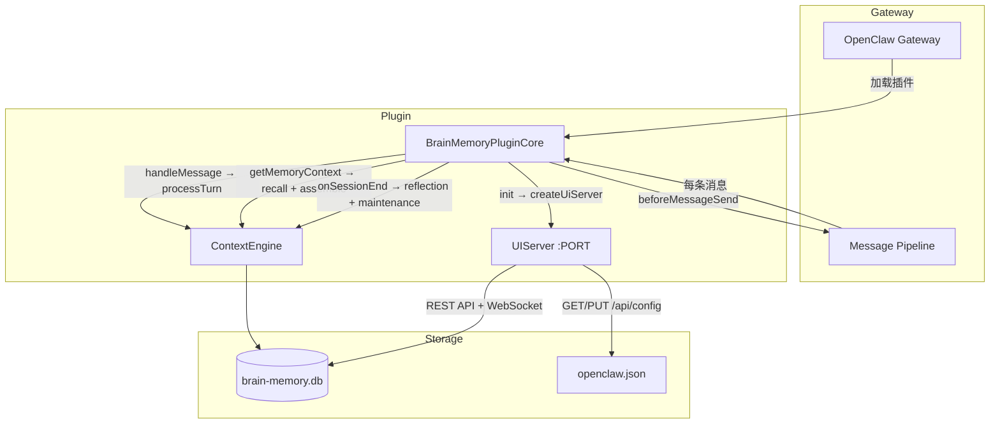

# Brain-Memory 边界与运行

> 骨架地图 #5 — 边界维度（外部依赖、降级行为、环境要求、集成拓扑）
>
> 交叉引用：[模块总览](./Brain-Memory%20项目功能模块总览.md) | [数据流文档](./Brain-Memory 数据流通道梳理.md) | [API 契约](./Brain-Memory API契约与测试矩阵.md) | [演进记录](./Brain-Memory 演进记录.md)
>
> 关联项目文档：[docs/deployment.md](../../docs/deployment.md) | [docs/security.md](../../docs/security.md) | [docs/architecture.md](../../docs/architecture.md)

---

## 第一部分：外部依赖拓扑

```mermaid
flowchart TB
    subgraph brain-memory
        CE[ContextEngine]
        PLUGIN[BrainMemoryPluginCore]
        UI[UIServer]
    end

    subgraph 必需依赖
        SQLITE["SQLite<br>(@photostructure/sqlite)"]
        FS["文件系统<br>(~/.openclaw/)"]
    end

    subgraph 可选依赖_LLM
        OPENAI["OpenAI API"]
        DASHSCOPE["DashScope<br>(阿里云通义千问)"]
        OLLAMA["Ollama<br>(本地部署)"]
        ANTHROPIC["Anthropic API"]
    end

    subgraph 可选依赖_Embedding
        EMBED_API["OpenAI-compatible<br>Embedding API"]
        OLLAMA_EMBED["Ollama Embedding<br>(/api/embed)"]
    end

    subgraph 可选依赖_语义索引
        LANCEDB["LanceDB<br>(向量数据库)"]
    end

    subgraph 可选依赖_重排序
        JINA["Jina Reranker"]
        SILICONFLOW["SiliconFlow"]
        VOYAGE["Voyage AI"]
    end

    subgraph 宿主系统
        OCL_GW["OpenClaw Gateway"]
    end

    CE --> SQLITE
    CE --> FS
    CE -.->|"llmEnabled"| OPENAI
    CE -.->|"llmEnabled"| DASHSCOPE
    CE -.->|"llmEnabled"| OLLAMA
    CE -.->|"llmEnabled"| ANTHROPIC
    CE -.->|"embedEnabled"| EMBED_API
    CE -.->|"embedEnabled"| OLLAMA_EMBED
    CE -.->|"ISearchIndex"| LANCEDB
    CE -.->|"rerank.enabled"| JINA
    CE -.->|"rerank.enabled"| SILICONFLOW
    CE -.->|"rerank.enabled"| VOYAGE

    PLUGIN --> OCL_GW
    UI --> FS

    style SQLITE fill:#c8e6c9
    style FS fill:#c8e6c9
    style OPENAI fill:#fff9c4
    style DASHSCOPE fill:#fff9c4
    style OLLAMA fill:#fff9c4
    style ANTHROPIC fill:#fff9c4
    style EMBED_API fill:#fff9c4
    style LANCEDB fill:#fff9c4
    style JINA fill:#e1f5fe
```



### 依赖清单

| 依赖 | 类型 | 包/服务 | 说明 |
|------|------|---------|------|
| SQLite | **运行时必需** | `@photostructure/sqlite` | 同步 SQLite，通过 IStorageAdapter 访问 |
| 文件系统 | **运行时必需** | `node:fs` / `node:os` | DB 文件 + openclaw.json 读写 + 备份 |
| LLM API | 可选 | OpenAI / DashScope / Ollama / Anthropic | 不可用时提取回退启发式 |
| Embedding API | 可选 | OpenAI-compatible / Ollama | 不可用时仅 FTS5 文本搜索 |
| LanceDB | **必需** | `@lancedb/lancedb` | 必需伴随语义索引，通过 ISearchIndex 注入，可随时从 SQLite 全量重建 |
| Reranker API | 可选 | Jina / SiliconFlow / Voyage | 不可用时回退余弦相似度 |
| OpenClaw Gateway | **宿主依赖** | `openclaw` | 插件加载 + 生命周期管理 |
| Node.js | **运行时必需** | ≥18 | 依赖 `node:crypto`, `node:http`, `node:events`, `node:fs` |

---

## 第二部分：降级行为矩阵

### 核心原则：每个可选依赖不可用时，系统继续工作，功能降级但不崩溃

| 依赖 | 不可用时的行为 | 影响范围 | 检测方式 |
|------|-------------|---------|---------|
| **LLM (全部)** | `llmEnabled=false` | 提取仅用 Tier1 启发式 · 反思跳过 · 融合跳过 · 推理跳过 · 社区摘要跳过 | `apiKey` 为空 → `createCompleteFn()` 返回 `null` |
| **LLM (部分端点)** | 按端点类型路由 | 仅该端点不可用，其他端点正常 | 每个请求的 `fetch` 返回值判断 |
| **Embedding** | `embedEnabled=false` | 向量搜索不可用 · 仅 FTS5 文本搜索 · 去重仅名称 Jaccard | `apiKey` 为空 → `createEmbedFn()` 返回 `null` |
| **LanceDB** | `searchIndex` 未注入 | 语义搜索路径跳过 · 图+向量双路径仍工作 | `searchIndex === null` |
| **Reranker** | `rerank.enabled=false` 或 API 不可用 | 回退余弦相似度排序 | `Reranker.rerank()` 内部 try-catch |
| **openclaw.json** | 文件不存在 | UI config 端点返回 404 | `existsSync(configPath)` |
| **DB 文件** | 路径不可写 | `throw StorageError` — **致命** | `new DatabaseSync(dbPath)` |

### 降级层级

```
┌─────────────────────────────────────────┐
│ L0: 全功能                               │
│ LLM ✓  Embed ✓  LanceDB ✓  Reranker ✓   │
│ → 完整 4 路径召回 + 反思 + 融合 + 推理 + 摘要│
├─────────────────────────────────────────┤
│ L1: 无 Reranker                          │
│ → 余弦相似度回退                          │
├─────────────────────────────────────────┤
│ L2: 无 LanceDB                           │
│ → 三路径召回(精确+泛化+外部)               │
├─────────────────────────────────────────┤
│ L3: 无 Embedding                         │
│ → FTS5 文本搜索 + 社区代表节点             │
├─────────────────────────────────────────┤
│ L4: 无 LLM (仅 SQLite)                   │
│ → 提取仅启发式 · 召回仅 FTS5 · 无反思融合推理│
│ → RecallResult 仍正常工作                  │
└─────────────────────────────────────────┘
```

---

## 第三部分：环境变量

| 变量 | 用途 | 默认值 | 影响范围 |
|------|------|--------|---------|
| `BM_LOG_LLM` | 启用 LLM 请求/响应详细日志 | (未设置) | `engine/llm.ts` |
| `ANTHROPIC_API_KEY` | Anthropic API 密钥（备选方式） | (未设置) | `engine/llm.ts` |
| `APPDATA` | Windows 配置目录 | (系统默认) | `ui/controllers/config.ts` |

---

## 第四部分：文件布局

```
~/.openclaw/
├── brain-memory.db          ← 主数据库（默认路径，可通过 dbPath 配置）
├── brain-memory.db.bak      ← 自动备份（PUT /api/config 时）
└── openclaw.json            ← Gateway 配置（brain-memory 插件配置存放在 plugins.entries["brain-memory"].config）
                                  PUT /api/config 写入此文件

<项目>/ui/
├── dist/                    ← Vite 构建产物（index.html + assets/）
│   └── index.html           ← Web UI 入口
└── public/
    └── embed-dashboard.html ← Canvas 嵌入视图
```

---

## 第五部分：集成拓扑（OpenClaw Gateway）



### 集成点

| 集成点 | Gateway 机制 | Plugin 回调 | 数据流向 |
|--------|-------------|------------|---------|
| 插件激活 | `definePluginEntry()` → `init()` | `BrainMemoryPluginCore.init()` | 配置 → ContextEngine + UIServer |
| 消息处理 | 每条用户消息 | `handleMessage()` | Message → processTurn → 存入 SQLite |
| 记忆召回 | 消息发送前 | `getMemoryContext()` → `beforeMessageSend()` | Message → recall + assemble → 注入 formattedMemory |
| 会话结束 | Session 生命周期 | `onSessionEnd()` | SessionEvent → reflection + maintenance |
| 状态查询 | 运行时查询 | `getStatus()` | ContextEngine.getStats() → JSON |
| 插件卸载 | Gateway 关闭 | `shutdown()` | UIServer.stop() + ContextEngine.close() |

---

## 第五部分：运行时行为

### 5.1 日志策略

`utils/logger.ts` 提供统一日志（基于 `console`），所有模块通过 `logger.info/warn/error/debug(module, message, ...args)` 输出。

| 级别 | 方法 | 用途 | 示例 |
|------|------|------|------|
| `INFO` | `logger.info()` | 关键状态变更 | `logger.info('context', 'Initialized with 42 existing nodes')` |
| `WARN` | `logger.warn()` | 降级/跳过/回退 | `logger.warn('context', 'LLM not configured — extraction will be skipped')` |
| `ERROR` | `logger.error()` | 组件失败 | `logger.error('context', 'Failed to initialize database:', error)` |
| `DEBUG` | `logger.debug()` | 详细诊断（需环境变量开启） | `logger.debug('recall', 'cache hit for query=...')` |

**格式**：`[brain-memory][时间戳][级别][模块] 消息`

**调试开关**：
- `BM_LOG_LLM=1` — 启用 LLM 请求/响应完整日志（`engine/llm.ts`），打印 `reqId + model + latency + attempt`

### 5.2 LLM 重试策略

`engine/llm.ts` 内置指数退避重试：

| 参数 | 值 | 说明 |
|------|----|------|
| 最大重试次数 | 3 | `MAX_RETRIES = 3` |
| 基础延迟 | 1000ms | `RETRY_BASE_DELAY_MS = 1000` |
| 退避公式 | `1000 × 2^(attempt-1)` | 1s → 2s → 4s |
| 重试条件 | HTTP 429（限流）/ 5xx（服务端错误）/ 网络错误 / 超时 | `isRetryableError()` |
| 不重试 | HTTP 4xx（客户端错误）/ 解析失败 | 直接 throw |

### 5.3 Embedding 缓存

`engine/embed.ts` 内置 LRU 缓存：

| 参数 | 值 |
|------|----|
| 最大条目 | 500 |
| TTL | 24 小时 |
| 驱逐策略 | LRU（超过上限删最早条目）+ TTL 过期（get 时惰性检查） |

缓存统计通过 `getEmbedCacheStats()` 暴露（hits/misses/hitRate），内含于 `EngineStats`。

---

## 第六部分：安全考量

> 详见项目文档 [docs/security.md](../../docs/security.md)

| 关注点 | 措施 | 位置 |
|--------|------|------|
| SQL 注入防护 | 全部 SQL 使用参数化查询 (`?` 占位符) | `store/storage/*.ts` |
| API 认证 | Bearer Token / Query Token（复用 Gateway authToken） | `ui/middleware/auth.ts` |
| 配置保护 | 原子写(tmp→rename) + .bak 备份 | `ui/controllers/config.ts` |
| Prompt Injection | 反思内容经过 6 种不安全模式正则过滤 | `reflection/extractor.ts` |
| 静态文件 | `/` 和 `/assets/*` 不受认证保护（设计如此） | `ui/server.ts` |
| 敏感信息 | `apiKey` 通过环境变量或配置文件传入，不入库 | `types.ts` · `BmConfig` |

---

## 第七部分：启动与运行要求

### 测试运行环境

```bash
# 单元测试（无需外部依赖）
npm test

# 集成测试（需要 LLM 和 Embedding）
BM_LLM_TEST=1 npm test -- test/integration/

# 性能基准
npm run bench

# 工程卫生检查（lint + tsc + test 一键）
node scripts/check-health.cjs
```

| 组件 | 要求 | 说明 |
|------|------|------|
| Node.js | ≥18 | `node:crypto`, `node:http`, `node:events` 等内置模块 |
| 构建工具 | `make` (Makefile) | `make build` / `make test` / `make lint` |
| 测试框架 | vitest 3.2.x | **不能升级到 v4**（SQLite lock 恶化 4x） |
| 测试辅助 | `test/helpers.ts` | 共享的 mock/stub 工具集 |

### 最小可运行配置

```json
{
  "dbPath": "~/.openclaw/brain-memory.db",
  "storage": "sqlite",
  "mode": "lite"
}
```

此配置仅需 SQLite，无需任何外部 API。

### 全功能配置

```json
{
  "dbPath": "~/.openclaw/brain-memory.db",
  "storage": "sqlite",
  "mode": "full",
  "llm": { "apiKey": "...", "baseURL": "...", "model": "..." },
  "embedding": { "apiKey": "...", "model": "text-embedding-3-small" }
}
```

### 本地部署配置（Ollama）

```json
{
  "llm": { "baseURL": "http://localhost:11434", "model": "qwen3:14b" },
  "embedding": { "baseURL": "http://localhost:11434", "model": "nomic-embed-text" },
  "mode": "full"
}
```

注意：Ollama 模式下 `apiKey` 不是必需的。

---

## 交叉引用

| 引用目标 | 链接 |
|---------|------|
| LLM 客户端的多端点路由逻辑 | [数据流文档 §engine/llm.ts](./Brain-Memory 数据流通道梳理.md) |
| UI Server 的认证和端口协商 | [数据流文档 L1-17](./Brain-Memory 数据流通道梳理.md) |
| 降级链的代码级实现（L3 管道中的触发点） | [数据流文档 L3-1~6](./Brain-Memory 数据流通道梳理.md) |
| export/import 的 JSON Schema | [API 契约 §数据格式契约](./Brain-Memory API契约与测试矩阵.md) |
| v1→v2 Breaking Change 迁移指南 | [MIGRATION-v2.md](../../MIGRATION-v2.md) |
| 版本迭代中的降级相关改进（v0.2.0 F-3） | [演进记录](./Brain-Memory 演进记录.md) |
| 项目部署文档 | [docs/deployment.md](../../docs/deployment.md) |
| 项目安全文档 | [docs/security.md](../../docs/security.md) |
| 项目架构文档 | [docs/architecture.md](../../docs/architecture.md) |
