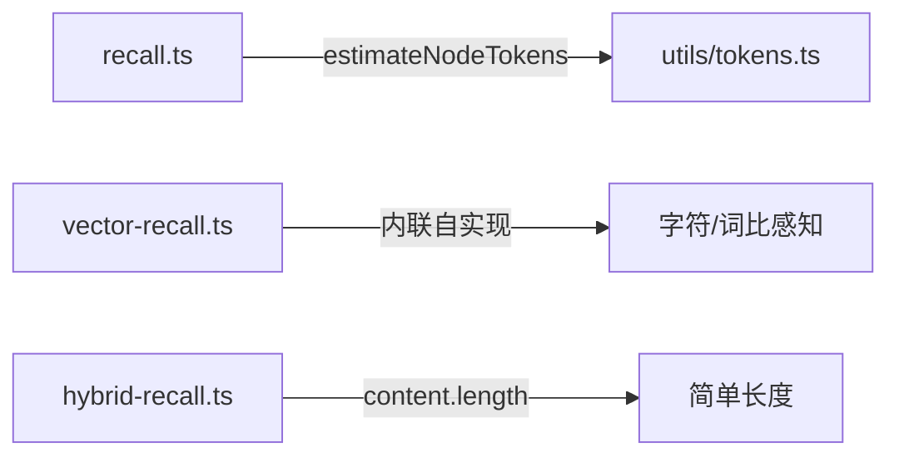

# M6: 检索引擎 — 审查报告

> **审查日期**: 2026-05-25  
> **审查范围**: 8 个文件（~1,200 行），覆盖多路径召回、混合检索、重排序、准入控制、意图分析、查询扩展  
> **审查维度**: 代码级 / 架构级 / 项目级 × 开发者视角 / 用户视角  

---

## 一、审查文件清单

| 文件 | 行数 | 核心功能 |
|------|------|----------|
| `src/recaller/recall.ts` | 398 | 双路径召回 + PPR 排序（主引擎） |
| `src/recaller/cache.ts` | 110 | LRU 查询缓存（脏标记失效） |
| `src/retriever/hybrid-recall.ts` | 104 | 图+向量 RRF 混合融合 |
| `src/retriever/vector-recall.ts` | 176 | 纯向量+FTS5 RRF 召回（无图依赖） |
| `src/retriever/reranker.ts` | 158 | 交叉编码器重排序 + 余弦回退 |
| `src/retriever/admission-control.ts` | 96 | 记忆写入准入控制（去重+质量） |
| `src/retriever/intent-analyzer.ts` | 65 | 规则式查询意图分类 |
| `src/retriever/query-expander.ts` | 80 | 中英文同义词查询扩展 |

---

## 二、问题清单

### 🔴 P0 — 阻塞级

> 本模块未发现 P0 级别的阻塞问题。

---

### 🟠 P1 — 高危级

#### P1-1: `matchesScope` 是 scope 匹配逻辑的第三次独立实现

**What**: 代码库中现在存在三套 scope 匹配逻辑：

| 位置 | 函数 | 匹配规则 |
|------|------|----------|
| `scope/isolation.ts` | `scopeMatchV2()` | 前缀匹配，NULL=通配 |
| `lancedb-adapter.ts` | `filterByScopeV2()` | 调用 `scopeMatchV2` |
| **`recaller/recall.ts`** | **`matchesScope()`** | 内联等值匹配，逻辑自实现 |

**Why 这是问题**: 
- 任何 scope 匹配逻辑的变更需要在三个位置同步
- `matchesScope` 实现中出现重复但正确的逻辑（与 `scopeMatchV2` 等价但不共享）
- M1-M3 已经反复发现 v1/v2 双 Scope 体系的问题，这进一步加剧了分散度

**Recommendation**: 将 `matchesScope` 替换为对 `scopeMatchV2` 的调用。

---

#### P1-2: `rerankWithApi` 混合公式对所有节点添加恒定 0.4 偏差

**What**: `reranker.ts:99-101`：
```typescript
const sA = (scores.get(a.id) ?? 0) * 0.6 + 0.4;
const sB = (scores.get(b.id) ?? 0) * 0.6 + 0.4;
```

**Why 这是问题**: 
- 一个与查询完全无关的节点（rerank score = 0）得到最终分数 `0 * 0.6 + 0.4 = 0.4`
- 一个有微弱相关性的节点（rerank score = 0.1）得到 `0.1 * 0.6 + 0.4 = 0.46`
- 差异只有 0.06 —— 重排序信号被大幅稀释
- 注释说 "60% rerank + 40% original"，但 original score 没有被保留到混合计算中——公式丢失了 PPR 分数

**Root Cause**: 混合公式设计时打算保留原始 PPR score 的 40% 权重，但实现中只是加了常数 0.4，未引用 `nodes` 中的原始 PPR 分数。

**Recommendation**: 将 0.4 替换为 `node.originalScore * 0.4`（需在 Reranker 构造函数中传入 PPR scores）。

---

#### P1-3: `rerankWithCosine` 为每个节点发起独立 embedding 调用（无批处理）

**What**: `reranker.ts:122-127`：
```typescript
for (const node of nodes) {
  const nodeVec = await embedFn(`${node?.name || ''}: ${node?.description || ''}`);
```

**Why 这是问题**: 
- 如果 20 个节点需要重排序，将产生 20 次独立的 embedding API 调用
- 每次调用都有网络往返延迟（通常 50-200ms） → 总延迟 1-4 秒
- 没有使用 `batchEmbed` 或并发控制

**对比**: `recall.ts` 有 `batchSyncEmbed()` 方法支持批量 embedding，但 `Reranker` 未利用。

**Recommendation**: 使用 `Promise.all()` 并发调用或提供 `batchEmbedFn` 参数。

---

#### P1-4: `recall.ts` 缓存失效仅依赖 dirty nodes 计数，无法感知 scope 级别变更

**What**: `cache.ts:40-42`：
```typescript
isValid(storage: IStorageAdapter): boolean {
  return storage.getDirtyNodes().size === 0;
}
```

**Why 这是问题**: 
- dirty nodes 是全局计数器——任何 scope 的新增节点都会使所有 scope 的缓存失效
- 反过来更糟：如果 scope A 无变更但 scope B 有变更，scope A 的缓存也会被错误地保留（因为 dirty nodes 可能已在之前的维护中清除）
- `isValid` 不跟踪 scope 维度的变更，导致 scope 过滤的缓存结果可能返回过期数据

**Recommendation**: `isValid` 增加 scope + dirty timestamp 维度，或在 `markDirty` 时维护每个 scope 的脏标记。

---

### 🟡 P2 — 中等级

#### P2-1: `estimateTokens` 在 vector-recall 和 recall 中实现不一致

**What**: 两个模块使用了不同的 token 估算公式：

| 文件 | 公式 | 特点 |
|------|------|------|
| `recaller/recall.ts` | `estimateNodeTokens(n)` → `utils/tokens.ts` | 简单：`content.length / 3 + 20` |
| `retriever/vector-recall.ts` | 内联自实现 | 中文感知：`charsPerToken = 1.8/2.5/3.5` |

**Why 这是问题**: 
- 同一查询通过 `HybridRecaller` 使用两个路径时，`tokenEstimate` 会因路径不同而不同
- `HybridRecallResult.tokenEstimate` 在 hybrid-recall.ts 中使用 `node.content?.length || 0`（第三种估算！）

**Recommendation**: 统一使用 `utils/tokens.ts` 的 `estimateNodeTokens`。

---

#### P2-2: `recaller/cache.ts` 的 `key()` 使用 `as any` 绕过类型系统

**What**: `cache.ts:28-34`：
```typescript
key(query: string, scopeFilter?: AnyFilter, ...): string {
  const inc = 'includeScopes' in (scopeFilter || {}) ? (scopeFilter as any).includeScopes : [];
  // ...
```

`AnyFilter = ScopeFilter | ScopeFilterV2` 联合类型使得无法直接访问 `includeScopes`（因为两个类型都有此字段但类型不同），被迫使用 `as any`。

**Recommendation**: 为两个过滤器类型提供统一的 `toCacheKey()` 方法，或定义一个 `CacheKeyableFilter` 接口。

---

#### P2-3: `hybrid-recall.ts` 丢弃了向量召回的边信息

**What**: `hybrid-recall.ts:89`：
```typescript
edges: graph.edges.filter(e => fusedIds.has(e.fromId) && fusedIds.has(e.toId)),
```

向量召回返回 `edges: []`，只有图召回的边被保留。但如果向量路径召回了与图相同的节点，这些节点之间的边可能已经被图路径覆盖。目前向量路径确实不返回边，所以不是 bug，但缺少文档说明。

**Recommendation**: 添加注释说明 vector recall 不返回边的设计原因。

---

### 🟢 P3 — 低等级

#### P3-1: `intent-analyzer.ts` 不区分中英文召回策略

**What**: `intent-analyzer.ts` 可以识别 `intent: 'technical'` / `'preference'` 等，但 `recall.ts` 只记录日志（`logger.debug`），未使用意图分类来优化召回策略（如 technical 意图时优先 SKILL/EVENT 节点）。

**Recommendation**: 利用 intent 结果调整向量搜索的 category 权重。

---

#### P3-2: `query-expander.ts` 同义词表维护成本高

14 条同义词规则全部硬编码。新增领域知识需要修改代码。对于长期维护项目，建议将同义词表配置化（JSON/YAML）。

---

## 三、架构级发现

### A-1: 四路召回的优雅设计

```
                查询输入
                   │
        ┌──────────┼──────────┐
        ▼          ▼          ▼
   精确路径    泛化路径   语义路径  外部记忆
  (向量/FTS5)  (社区向量)  (LanceDB)  (USER/MEMORY)
        │          │          │          │
        └──────────┴──────────┴──────────┘
                   │
           统一种子去重 (unifiedSeeds)
                   │
            单次 graphWalk
                   │
            单次 PPR 排序
                   │
            时间衰减 + 源过滤
                   │
              最终 Top-N
```

这是一个精心设计的多路径融合架构。四条路径产生互补的种子节点，通过单次图遍历统一扩展，单次 PPR 统一排序——避免了各路径独立排序后再人工合并的问题。

### A-2: 三重 token 估算不一致



三个路径使用了三种不同的 token 估算方法。对于最终用户（在 ContextEngine.getStats 中查看 token 估算），不同引擎模式会给出不同数量的预估——这让 token 预算管理变得不可靠。

### A-3: Recaller 作为上帝对象

`Recaller` 类（398 行）承担了过多职责：
- 查询缓存管理
- 四种子获取（精确/泛化/语义/外部）
- 图遍历 + PPR 排序
- 嵌入同步（batchSyncEmbed / syncEmbed）
- 文本分块 + 向量聚合

建议将 embedding 同步逻辑移到 `EmbeddingService` 独立模块中。

---

## 四、统计总结

| 级别 | 数量 | 关键问题 |
|------|------|----------|
| 🔴 P0 阻塞 | 0 | — |
| 🟠 P1 高危 | 4 | matchesScope 第三次重复实现、重排序混合公式丢失 PPR 分数、余弦重排无批处理、缓存不感知 scope 变更 |
| 🟡 P2 中等 | 3 | 三重 token 估算不一致、key() 使用 as any、向量边被丢弃未文档化 |
| 🟢 P3 低 | 2 | intent 未用于优化召回策略、同义词表硬编码 |

---

## 五、审批状态

- [ ] **已审批，继续下一模块**
- [ ] **需要修改后复审**

> 请老板审阅以上发现，确认后我将继续 **M7: 核心引擎与工作内存** 的审查。
