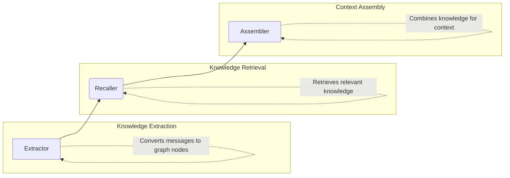

# 🧠 brain-memory

> Unified knowledge graph + vector memory system for AI agents

<div align="center">

[](https://opensource.org/licenses/MIT)
[](https://nodejs.org/)
[](https://www.typescriptlang.org/)
[](https://github.com/your-repo/brain-memory)

**Merges graph-memory (knowledge graphs) with vector memory into an 8-category system with intelligent decay and reflection.**

</div>

## ✨ Features

| Feature | Description |
|--------|-------------|
| **8-Category Memory System** | profile, preferences, entities, events, tasks, skills, cases, patterns |
| **3 Graph Node Types** | TASK, SKILL, EVENT with 5 relationship types |
| **Dual-Path Recall** | Graph + Vector retrieval with personalized PageRank |
| **Intelligent Decay** | Weibull model-based forgetting with configurable tiers |
| **Reflection System** | Session-level insights with safety filtering |
| **Multi-Scope Isolation** | Per-session/agent/workspace memory isolation |
| **Noise Filtering** | Automatic filtering of irrelevant content |
| **Knowledge Fusion** | Duplicate detection and merging |
| **Reasoning Engine** | Path derivation, implicit relations, pattern generalization |

## 🏗️ Architecture

<div align="center">



*Graph-based knowledge extraction, retrieval, and assembly pipeline*

</div>

## 🚀 Installation

```bash
# Clone the repository
git clone <repository-url>

# Navigate to project directory
cd brain-memory

# Install dependencies
npm install
```

## ⚙️ Configuration

### Interactive Setup Script

The project includes an interactive configuration script to help you set up your API credentials:

```bash
# Run the interactive configuration script
node scripts/configure.js
```

This script will guide you through:

- 🔍 Selecting your API provider (DashScope, OpenAI, SiliconFlow, or custom)
- 🔐 Entering your API credentials
- 📋 Generating the necessary configuration files

### Environment Variables

Alternatively, create `.env` file with your settings:

```env
# LLM Configuration
LLM_BASE_URL=your_llm_base_url
LLM_API_KEY=your_api_key
LLM_MODEL=your_model_name

# Embedding Configuration
EMBEDDING_MODEL=your_embedding_model
EMBEDDING_BASE_URL=your_embedding_base_url
```

### JavaScript Configuration

For programmatic configuration, create `config.js` based on the template:

```bash
cp config.template.js config.js
```

Then edit `config.js` to add your actual credentials.

## 🔗 OpenClaw Integration

To integrate with OpenClaw, use the built-in setup script:

```bash
# Run the OpenClaw integration script
node scripts/setup.js
```

This script will guide you through:

- 🔍 Selecting your API provider (DashScope, OpenAI, SiliconFlow, or custom)
- 🔐 Entering your API key
- 📝 Automatically generating and writing the complete configuration to OpenClaw config file
- 💾 Creating a backup of your existing configuration

## 💻 Usage

```typescript
import { ContextEngine } from './src/engine/context.ts';
import { DEFAULT_CONFIG } from './src/types.ts';

const engine = new ContextEngine(DEFAULT_CONFIG);

// Process a conversation turn
const result = await engine.process({
  messages: [
    { role: 'user', content: 'How do I deploy a Flask app?' },
    { role: 'assistant', content: 'You can use Docker for deployment.' }
  ],
  sessionId: 'session-1'
});

// Retrieve relevant knowledge
const recall = await engine.recall('docker deployment');
```

## 🧪 Testing

```bash
# Run unit tests
npm test

# Run specific test suites
npm run test:unit
npm run test:integration
npm run test:performance
```

## 🛠️ Build Commands

```bash
# Build the project
npm run build

# Clean build artifacts
npm run clean

# Run linting
npm run lint

# Generate documentation
npm run docs
```

## 📁 Directory Structure

<details>
<summary>Click to expand directory structure</summary>

```
src/                 # Source code
├── store/          # Database operations
├── extractor/      # Knowledge extraction
├── recaller/       # Knowledge retrieval
├── reasoning/      # Inference engine
├── reflection/     # Reflection system
├── fusion/         # Knowledge fusion
├── decay/          # Decay algorithms
├── scope/          # Multi-tenant isolation
├── temporal/       # Time-based processing
├── noise/          # Noise filtering
├── working-memory/ # Working memory management
├── format/         # Context formatting
├── engine/         # Core engine components
└── utils/          # Utility functions

tests/              # Test files
├── unit/           # Unit tests
├── integration/    # Integration tests
├── performance/    # Performance tests
└── data/           # Test data

docs/               # Documentation
scripts/            # Build/deploy scripts
```

</details>

## 📚 API Reference

### ContextEngine
Main interface for the memory system.

#### Methods:
- `process(params)`: Process conversation messages and update memory
- `recall(query)`: Retrieve relevant knowledge
- `maintain()`: Run maintenance tasks (compaction, decay, etc.)

## 🤝 Contributing

We welcome contributions from the community! Here's how you can help:

<div align="center">

| Step | Action |
|------|--------|
| 🍴 | **Fork** the repository |
| 🌿 | **Create** a feature branch |
| ✍️ | **Make** your changes |
| 🧪 | **Add** tests for new functionality |
| 🚀 | **Submit** a pull request |

</div>

## 📄 License

[MIT License](./LICENSE) ©️ DylingCreation's Openclaw-Agents Team

## 🚀 Deployment Steps

1. 📦 **Clone** the repository to your desired path
2. 🔧 **Install** dependencies: `npm install`
3. ⚙️ **Configure** using the interactive script: `node scripts/configure.js`
4. 🏗️ **Build** the project: `npm run build`
5. 🔗 **For OpenClaw integration**: `node scripts/setup.js`
6. ✅ **Test** the deployment: `npm test` or run `npx tsx validate_features.js`
