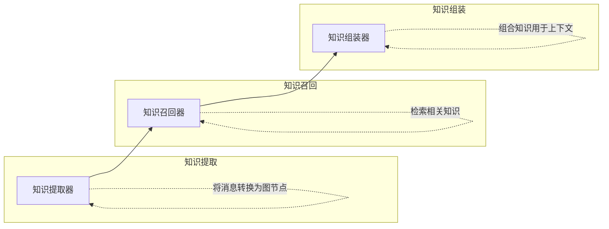

# 🧠 brain-memory

> 统一的知识图谱 + 向量记忆系统，专为AI代理设计

<div align="center">

[](https://opensource.org/licenses/MIT)
[](https://nodejs.org/)
[](https://www.typescriptlang.org/)
[](https://github.com/DylingCreation/brain-memory)

**将知识图谱与向量记忆融合为8类系统的统一记忆系统，具备智能遗忘和反思功能。**

</div>

## ✨ 特性

| 特性 | 描述 |
|--------|-------------|
| **8类记忆系统** | 个人资料、偏好、实体、事件、任务、技能、案例、模式 |
| **3种图节点类型** | 任务(TASK)、技能(SKILL)、事件(EVENT)，支持5种关系类型 |
| **双路径召回** | 图谱 + 向量检索，支持个性化PageRank |
| **智能遗忘** | 基于威布尔模型的遗忘机制，支持可配置层级 |
| **反思系统** | 会话级洞察，带安全过滤 |
| **多范围隔离** | 按会话/代理/工作空间隔离记忆 |
| **噪声过滤** | 自动过滤无关内容 |
| **知识融合** | 重复检测与合并 |
| **推理引擎** | 路径推导、隐含关系、模式泛化 |

## 🏗️ 架构

<div align="center">



*基于图谱的知识提取、召回和组装流水线*

</div>

## 🚀 安装

```bash
# 克隆仓库
git clone <repository-url>

# 进入项目目录
cd brain-memory

# 安装依赖
npm install
```

## ⚙️ 配置

### 交互式配置脚本

项目包含交互式配置脚本，帮助您设置API凭证：

```bash
# 运行交互式配置脚本
node scripts/configure.js
```

该脚本将引导您完成：

- 🔍 选择API提供商（DashScope、OpenAI、SiliconFlow或自定义）
- 🔐 输入您的API凭证
- 📋 生成必要的配置文件

### 环境变量

或者，创建 `.env` 文件并添加您的设置：

```env
# LLM配置
LLM_BASE_URL=your_llm_base_url
LLM_API_KEY=your_api_key
LLM_MODEL=your_model_name

# 嵌入配置
EMBEDDING_MODEL=your_embedding_model
EMBEDDING_BASE_URL=your_embedding_base_url
```

### JavaScript配置

对于程序化配置，基于模板创建 `config.js`：

```bash
cp config.template.js config.js
```

然后编辑 `config.js` 以添加您的实际凭据。

## 🔗 OpenClaw集成

要与OpenClaw集成，请使用内置的设置脚本：

```bash
# 运行OpenClaw集成脚本
node scripts/setup.js
```

该脚本将引导您完成：

- 🔍 选择API提供商（DashScope、OpenAI、SiliconFlow或自定义）
- 🔐 输入您的API密钥
- 📝 自动生成并将完整配置写入OpenClaw配置文件
- 💾 创建现有配置的备份

## 💻 使用方法

```typescript
import { ContextEngine } from './src/engine/context.ts';
import { DEFAULT_CONFIG } from './src/types.ts';

const engine = new ContextEngine(DEFAULT_CONFIG);

// 处理对话回合
const result = await engine.process({
  messages: [
    { role: 'user', content: '如何部署Flask应用？' },
    { role: 'assistant', content: '您可以使用Docker进行部署。' }
  ],
  sessionId: 'session-1'
});

// 检索相关知识
const recall = await engine.recall('docker部署');
```

## 🧪 测试

```bash
# 运行单元测试
npm test

# 运行特定测试套件
npm run test:unit
npm run test:integration
npm run test:performance
```

## 🛠️ 构建命令

```bash
# 构建项目
npm run build

# 清理构建产物
npm run clean

# 运行代码检查
npm run lint

# 生成文档
npm run docs
```

## 📁 目录结构

<details>
<summary>点击展开目录结构</summary>

```
src/                 # 源代码
├── store/          # 数据库操作
├── extractor/      # 知识提取
├── recaller/       # 知识召回
├── reasoning/      # 推理引擎
├── reflection/     # 反思系统
├── fusion/         # 知识融合
├── decay/          # 遗忘算法
├── scope/          # 多租户隔离
├── temporal/       # 基于时间的处理
├── noise/          # 噪声过滤
├── working-memory/ # 工作记忆管理
├── format/         # 上下文格式化
├── engine/         # 核心引擎组件
└── utils/          # 工具函数

tests/              # 测试文件
├── unit/           # 单元测试
├── integration/    # 集成测试
├── performance/    # 性能测试
└── data/           # 测试数据

docs/               # 文档
scripts/            # 构建/部署脚本
```

</details>

## 📚 API参考

### ContextEngine
记忆系统的主要接口。

#### 方法：
- `process(params)`: 处理对话消息并更新记忆
- `recall(query)`: 检索相关知识
- `maintain()`: 运行维护任务（压缩、遗忘等）

## 🤝 贡献

我们欢迎社区的贡献！以下是参与方式：

<div align="center">

| 步骤 | 行动 |
|------|--------|
| 🍴 | **Fork** 仓库 |
| 🌿 | **创建** 功能分支 |
| ✍️ | **进行** 修改 |
| 🧪 | **添加** 新功能的测试 |
| 🚀 | **提交** 拉取请求 |

</div>

## 📄 许可证

[MIT License](./LICENSE) ©️ DylingCreation的Openclaw-Agents团队

## 🚀 部署步骤

1. 📦 **克隆** 仓库到您的目标路径
2. 🔧 **安装** 依赖：`npm install`
3. ⚙️ **配置** 使用交互式脚本：`node scripts/configure.js`
4. 🏗️ **构建** 项目：`npm run build`
5. 🔗 **OpenClaw集成**：`node scripts/setup.js`
6. ✅ **测试** 部署：`npm test` 或运行 `npx tsx validate_features.js`
